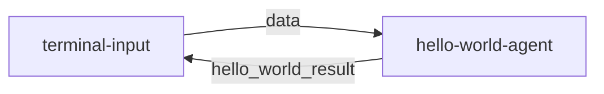

# **1. MoFA Development Framework**

[English](README.md) | [简体中文](README_cn.md)

## **1.1 Framework Core Manual**

### **1.1.1 Design Philosophy**

MoFA is a software framework for building AI agents in a compositional way. With MoFA, AI agents can be built using templates and combined through stacking to form more powerful Super Agents.

MoFA's unique design philosophy is:

- **Ordinary People Doing Extraordinary Things**: AI should not be exclusive to elites and giants. MoFA empowers everyone to harness and develop AI, turning the impossible into possible, and enabling ordinary people to create the extraordinary.
- **Composition AI**: Inspired by the Unix philosophy, MoFA takes "composition" as its core principle. You can build agents, connect agents, and integrate tools like building blocks, making AI simple, flexible, and powerful.
- **Everything Agent**: Unlike most software, in the world of MoFA, an Agent is the Application of the AI era. It's not just large language models; it can be code, scripts, APIs, or even MoFA itself. MoFA is not just a framework, but an Agent ecosystem.
- **Data Flow**: Most agent frameworks rely on complex workflows, while MoFA chooses a more intuitive and powerful data flow. This approach allows agents to be freely combined, disassembled, and reused.

### **1.1.2 Technical Architecture Diagram**


# 2. **Quick Start Guide**

## **2.1 Development Environment Preparation**

### 2.1.1 Python Environment

```bash
# Install UV package manager to speed up mofa installation
pip install uv
```

### **Note**:
- The local Python environment should be pure and avoid having multiple Python versions, otherwise it may easily lead to conflicts between the Dora-rs runtime environment and the MoFA installation environment.
- If you are using Anaconda / Miniconda, be sure to install MoFA in the `Base` environment to ensure consistency between the Dora runtime environment and the MoFA environment.
- Python environment >= 3.10 is required.

### 2.1.2 Rust Environment
```bash
# Install Rust
curl --proto '=https' --tlsv1.2 -sSf [https://sh.rustup.rs](https://sh.rustup.rs) | sh

# Install Dora Runtime
cargo install dora-cli

# Verify installation
rustc --version
cargo --version
dora --version
```

## 2.2 Install MoFa

### 2.2.1 Git Clone Method
```bash
# Clone repository
git clone [https://github.com/moxin-org/mofa.git](https://github.com/moxin-org/mofa.git)
cd mofa/python

# Install dependencies
uv pip install -e .
pip install -e .
```

### 2.2.2 Docker Method
```bash
# Enter docker directory
cd /mofa/python/docker
# Build image
docker build -t mofa -f Dockerfile_x86 .

# Run container
docker run -it --rm mofa

# Verify installation in the container
mofa --help
```

## **2.3 Run Your First Hello World**

### 2.3.1 Start Dataflow
```bash
cd  /project/mofa/python/examples/hello_world

# Start Dora service
dora up

# Build and run dataflow
dora build hello_world_dataflow.yml
dora start hello_world_dataflow.yml
```

### 2.3.2 Test Interaction
```bash
# Run input node in another terminal
terminal-input

# Enter test data
> hello
# Expected output: hello
```

### 2.3.3 **Running Effect**

```
root@root hello_world % terminal-input
 Send You Task :  你好
-------------hello_world_result---------------
你好
---------------------------------------
 Send You Task :  你是谁
-------------hello_world_result---------------
你是谁
---------------------------------------
```

## **2.4 Develop Your First Application in 5 Minutes**

This guide will help you quickly create an Agent based on a large language model, following the simple implementation of hello-world.

### 2.4.1. Create Agent Project (1 minute)

Use MoFa CLI to create a new Agent:
```bash
# Create a new Agent project
mofa new-agent my-llm-agent
cd my-llm-agent
```

### 2.4.2. Configure Environment Variables (1 minute)

Create a `.env.secret` file:
```plaintext
LLM_API_KEY=your_api_key_here
LLM_API_BASE=[https://api.openai.com/v1](https://api.openai.com/v1)  # Or other API address
LLM_MODEL=gpt-3.5-turbo  # Or other model name
```

### 2.4.3. Implement Agent Logic (2 minutes)

Edit `my_llm_agent/main.py`:
```python
from mofa.agent_build.base.base_agent import MofaAgent, run_agent
from openai import OpenAI
import os
from dotenv import load_dotenv

@run_agent
def run(agent: MofaAgent):
    try:
        # Load environment variables
        load_dotenv('.env.secret')

        # Initialize OpenAI client
        client = OpenAI(
            api_key=os.getenv('LLM_API_KEY'),
            base_url=os.getenv('LLM_API_BASE')
        )

        # Receive user input
        user_input = agent.receive_parameter('query')

        # Call LLM
        response = client.chat.completions.create(
            model=os.getenv('LLM_MODEL', 'gpt-3.5-turbo'),
            messages=[
                {"role": "system", "content": "You are a helpful AI assistant."},
                {"role": "user", "content": user_input}
            ],
            stream=False
        )

        # Send output
        agent.send_output(
            agent_output_name='llm_result',
            agent_result=response.choices[0].message.content
        )

    except Exception as e:
        agent.logger.error(f"Error: {str(e)}")
        agent.send_output(
            agent_output_name='llm_result',
            agent_result=f"Error: {str(e)}"
        )

def main():
    agent = MofaAgent(agent_name='my-llm-agent')
    run(agent=agent)

if __name__ == "__main__":
    main()
```

### 2.4.4. Create Dataflow Configuration (1 minute)

Create `my_llm_dataflow.yml`:
```yaml
nodes:
  - id: terminal-input
    build: pip install -e ../../node-hub/terminal-input
    path: dynamic
    outputs: data
    inputs:
      agent_response: my-llm-agent/llm_result

  - id: my-llm-agent
    build: pip install -e . ../../agent-hub/my-llm-agent
    path: my-llm-agent
    outputs: llm_result
    inputs:
      query: terminal-input/data
    env:
      IS_DATAFLOW_END: true
      WRITE_LOG: true
```
**Hint**:
- Remember not to put the example and dataflow in the same folder, make sure they are in different folders.

### 2.4.5. Run and Test

```bash
# Start dataflow
dora up
dora build my_llm_dataflow.yml
dora start my_llm_dataflow.yml

# Open a new terminal for testing
terminal-input
> Hello, please introduce yourself
```

### 2.4.6. Code Explanation

1. **Using Decorators**
   - Simplify code structure using the `@run_agent` decorator
   - Automatically handle loops and exceptions

2. **Simple Input and Output**
   - Receive a single input parameter `query`
   - Return a single output result `llm_result`

3. **Error Handling**
   - Use try-except to catch exceptions
   - Record error logs
   - Return error information to the user

### 2.4.7. Custom Options

1. **Modify System Prompt**
```python
messages=[
    {"role": "system", "content": "Your custom system prompt"},
    {"role": "user", "content": user_input}
]
```

2. **Change LLM Provider**
   - Modify the API configuration in `.env.secret`
   - Adjust model parameters as needed

### 2.4.8. Precautions

1. Ensure `.env.secret` is added to `.gitignore`
2. Keep API keys safe
3. Maintain a simple and clear code structure

## **2.5 Dataflow Deep Dive**

(Taking hello-world as an example)

### 2.5.1. Dataflow Process


The dataflow contains two nodes:
1. **terminal-input**: Terminal input node, responsible for receiving user input
2. **hello-world-agent**: Agent node, responsible for processing input and returning results

### 2.5.2. Node Characteristics
Each node is multi-input and multi-output, and supports continuous streaming processing:
- **Continuous Flow of Input and Output**: Similar to OpenAI's stream mode
- **Dynamic Processing**: Input and output are dynamically controlled by code
- **Two-way Communication**: Nodes can send messages to each other

### 2.5.3. Key Configuration Explanations

#### 2.5.3.1 IS_DATAFLOW_END
```yaml
env:
  IS_DATAFLOW_END: true
```
- Marks whether the current node is the last node in the dataflow
- When this node sends a message, it indicates the end of the entire process
- After the process ends, a new processing loop will automatically start from the beginning

#### 2.5.3.2 WRITE_LOG
```yaml
env:
  WRITE_LOG: true
```
- Enables the log recording function
- Records all inputs and outputs of the current node
- Logs are saved in the `logs/` directory
- Log format:
  ```log
  2025-03-06 11:31:14,172 - INFO: "hello-world receive data: hello"
  2025-03-06 11:31:14,173 - INFO: "output name: hello_world_result output data: hello"
  ```

### 2.5.4. Dataflow Example
```yaml
nodes:
  - id: terminal-input
    build: pip install -e ../../node-hub/terminal-input
    path: dynamic
    outputs: data
    inputs:
      agent_response: hello-world-agent/hello_world_result

  - id: hello-world-agent
    build: pip install -e ../../agent-hub/hello-world
    path: hello-world
    outputs: hello_world_result
    inputs:
      query: terminal-input/data
    env:
      IS_DATAFLOW_END: true
      WRITE_LOG: true
```

### 2.5.5. Processing Flow Details
1. The user inputs data through terminal-input
2. terminal-input sends the data to hello-world-agent
3. hello-world-agent processes the data and returns the result
4. The result is returned to terminal-input for display
5. Because IS_DATAFLOW_END=true, the process ends and restarts

### 2.5.6. Log File Location
- `logs/log_hello-world-agent.txt`: Agent runtime log
- `logs/dora-coordinator.txt`: Coordinator log
- `logs/dora-daemon.txt`: Daemon process log

### 2.5.7. Best Practices
1. Use WRITE_LOG to debug dataflow
2. Set IS_DATAFLOW_END reasonably to control process termination
3. Keep input and output parameter types consistent
4. Use environment variables to control debugging mode
5. Regularly clean up old logs in the `logs/` directory

# **3. Advanced Development Manual**

## 3.1 **Building Custom Agents**

### 3.1.1 Creating with Templates
```bash
mofa new-agent you_agent_name
```
**Hint**:
- You can use `mofa new-agent --help` to view information about creating Agents.

### 3.1.2 Project Structure
```
my-new-agent/
├── agent/
│   ├── configs/
│   │   └── agent.yml       # Configuration file
│   ├── main.py             # Main program
│   └── __init__.py
├── tests/
│   └── test_main.py        # Test code
├── pyproject.toml          # Dependency configuration
└── README.md               # Project documentation
```

### 3.1.3 Core Code Example
```python
from mofa.agent_build.base.base_agent import MofaAgent, run_agent

@run_agent
def run(agent: MofaAgent):
    try:
        # Receive single agent input
        task = agent.receive_parameter('task')

        # Receive multiple agent inputs
        receive_datas = agent.receive_parameter(['example_one','example_two'])
        # Result is similar to {'example_one':'example_one_data','example_two':'example_two_data'}

        # Processing logic You can add your logic here
        result = process_task(task)

        # Send output Make sure your output is a serializable object (string, etc.)
        agent.send_output(
            agent_output_name='agent_result',
            agent_result=result
        )

    except Exception as e:
        agent.logger.error(f"Error: {str(e)}")


def process_task(data: str) -> str:
    """Example processing function"""
    return f"Processed: {data}"

def main():
    agent = MofaAgent(agent_name='my-new-agent')
    run(agent=agent)

if __name__ == "__main__":
    main()
```
```