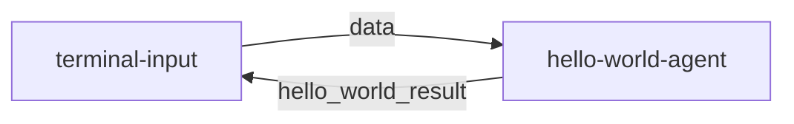

# **1. MoFA Development Framework**

[English](README.md) | [简体中文](README_cn.md)

## **1.1 Core Manual of the Framework**

### **1.1.1 Design Philosophy**

MoFA is a software framework for building AI agents through composition. With MoFA, AI agents can be constructed using templates and stacked together to form more powerful super agents.

The unique design philosophy of MoFA is:

- **Ordinary people doing extraordinary things**: AI should not be the exclusive domain of elites and giants. MoFA allows everyone to harness and develop AI, turning the impossible into possible, enabling ordinary people to create extraordinary outcomes.
- **Composition AI**: Inspired by the Unix philosophy, MoFA uses "composition" as its core principle. You can build, connect, and integrate agents and tools as if you were stacking building blocks, making AI simple, flexible, and powerful.
- **Everything Agent**: Unlike most software, in the world of MoFA, an agent is the application of the AI era. Not only large language models, it can also be code, scripts, APIs, or even MoFA itself. MoFA is not a framework; it is an Agent ecosystem.
- **Data Flow**: Most agent frameworks rely on complex workflows, but MoFA opts for a more intuitive and powerful data flow. This approach allows agents to freely combine, decompose, and reuse.

### **1.1.2 Technical Architecture Diagram**


# 2. **Quick Start Guide**

## **2.1 Development Environment Setup**

### 2.1.1 Python Environment

```bash
# Install the UV package manager to speed up MoFA installation
pip install uv
```

### **Note**:
- Ensure that the Python environment is clean, with no multiple Python versions, to avoid conflicts between the Dora-rs runtime and MoFA installation.
- If you are using Anaconda / Miniconda, make sure to install MoFA in the `Base` environment to maintain consistency between the Dora runtime and MoFA environment.
- Python version >= 3.10 is required.
- We have currently tested on WSL (Ubuntu 22.04) and macOS. Windows is not supported at this time
### 2.1.2 Rust Environment

```bash
# Install Rust
curl --proto '=https' --tlsv1.2 -sSf https://sh.rustup.rs | sh

# Install Dora runtime
cargo install dora-cli

# Verify installation
rustc --version
cargo --version
dora --version
```

## 2.2 Install MoFA

### 2.2.1 Git Clone Method

```bash
# Clone the repository
git clone https://github.com/moxin-org/mofa.git
cd mofa/python

# Install dependencies
uv pip install -e . && pip install -e . 
# uv speeds up dependency installation, and pip install -e . will compile the Python files into .pyc files and install MoFA into the current Python environment
```

### 2.2.2 Docker Method

```bash
# Go to the docker directory
cd /mofa/python/docker
# Build the image
docker build -t mofa -f Dockerfile_x86 .

# Run the container
docker run -it --rm mofa

# Verify installation within the container
mofa --help 
```

## **2.3 Run Your First Hello World**

### 2.3.1 Start the Data Flow

```bash
cd  /mofa/python/examples/hello_world

# Start the Dora service
dora up

# Build and run the data flow
dora build hello_world_dataflow.yml
dora start hello_world_dataflow.yml
```

### 2.3.2 Test Interaction

```bash
# In another terminal, run the input node
terminal-input

# Enter test data
> hello
# Expected output: hello
```

Sample interaction result:

```
root@root hello_world % terminal-input                                           
 Send You Task :  你好
-------------hello_world_result---------------    
你好 
---------------------------------------  
 Send You Task :  你是谁   
-------------hello_world_result---------------    
你是谁    
---------------------------------------
```

## **2.4 Develop Your First Application in 5 Minutes**

This guide will help you quickly create an agent based on a large language model, following the simple implementation of hello-world.

### 2.4.1. Create the Agent Project (1 minute)

Use the MoFA CLI to create a new agent:

```bash
# Create a new agent project
mofa new-agent my-llm-agent
cd my-llm-agent
```

### 2.4.2. Configure Environment Variables (1 minute)

Create the `.env.secret` file (create it at the same level as the Dataflow.yml directory):

```plaintext
LLM_API_KEY=your_api_key_here
LLM_API_BASE=https://api.openai.com/v1  # or another API address
LLM_MODEL=gpt-3.5-turbo  # or another model name
```

### 2.4.3. Implement the Agent Logic (2 minutes)

Edit `my_llm_agent/main.py`:

```python
from mofa.agent_build.base.base_agent import MofaAgent, run_agent
from openai import OpenAI
import os
from dotenv import load_dotenv

@run_agent
def run(agent: MofaAgent):
    try:
        # Load environment variables
        load_dotenv('.env.secret')
        
        # Initialize OpenAI client
        client = OpenAI(
            api_key=os.getenv('LLM_API_KEY'),
            base_url=os.getenv('LLM_API_BASE')
        )
        
        # Receive user input
        user_input = agent.receive_parameter('query')
        
        # Call LLM
        response = client.chat.completions.create(
            model=os.getenv('LLM_MODEL', 'gpt-3.5-turbo'),
            messages=[
                {"role": "system", "content": "You are a helpful AI assistant."},
                {"role": "user", "content": user_input}
            ],
            stream=False
        )
        
        # Send output
        agent.send_output(
            agent_output_name='llm_result',
            agent_result=response.choices[0].message.content
        )
        
    except Exception as e:
        agent.logger.error(f"Error: {str(e)}")
        agent.send_output(
            agent_output_name='llm_result',
            agent_result=f"Error: {str(e)}"
        )

def main():
    agent = MofaAgent(agent_name='my-llm-agent')
    run(agent=agent)

if __name__ == "__main__":
    main()
```

### 2.4.4. Create Data Flow Configuration (1 minute)

Create `my_llm_dataflow.yml`:

```yaml
nodes:
  - id: terminal-input
    build: pip install -e ../../node-hub/terminal-input
    path: dynamic
    outputs: data
    inputs:
      agent_response: my-llm-agent/llm_result

  - id: my-llm-agent
    build: pip install -e . ../../agent-hub/my-llm-agent
    path: my-llm-agent
    outputs: llm_result
    inputs:
      query: terminal-input/data
    env:
      IS_DATAFLOW_END: true
      WRITE_LOG: true
```

**Tip**:
- Ensure that the case files are not placed in the same folder as the dataflow. Keep them in separate directories.

### 2.4.5. Run and Test

```bash
# Start the data flow
dora up
dora build my_llm_dataflow.yml
dora start my_llm_dataflow.yml

# Open a new terminal for testing
terminal-input
> 你好，请介绍一下自己
```

### 2.4.6. Code Explanation

1. **Using Decorators**
   - The `@run_agent` decorator simplifies the code structure.
   - It handles loops and exceptions automatically.

2. **Simple Input and Output**
   - Receives a single input parameter `query`.
   - Returns a single output result `llm_result`.

3. **Error Handling**
   - Uses `try-except` to catch exceptions.
   - Logs errors and returns error messages to the user.

### 2.4.7. Custom Options

1. **Modify System Prompt**

```python
messages=[
    {"role": "system", "content": "Your custom system prompt"},
    {"role": "user", "content": user_input}
]
```

2. **Switch LLM Providers**
   - Modify the API configuration in `.env.secret`.
   - Adjust model parameters as needed.

### 2.4.8. Notes

1. Ensure `.env.secret` is added to `.gitignore`.
2. Keep API keys secure.
3. Keep the code structure simple and clear.

## **2.5 Data Flow Detailed Explanation**

(Using the hello-world example)

### 2.5.1. Data Flow Process



The data flow consists of two nodes:
1. **terminal-input**: The terminal input node, responsible for receiving user input.
2. **hello-world-agent**: The agent node, responsible for processing the input and returning the result.

### 2.5.2. Node Features
Each node is multi-input, multi-output, and supports continuous streaming:
- **Input/Output Flow**: Similar to OpenAI's stream mode.
- **Dynamic Processing**: Inputs and outputs are dynamically controlled via code.
- **Bidirectional Communication**: Nodes can send messages to each other.

### 2.5.3. Key Configuration Explanation

#### 2.5.3.1 IS_DATAFLOW_END

```yaml
env:
  IS_DATAFLOW_END: true
```
- Marks whether the current node is the last one in the data flow.
- When this node sends a message, it signifies the end of the entire process.
- The process will restart automatically after the flow ends.

#### 2.5.3.2 WRITE_LOG

```yaml
env:
  WRITE_LOG: true
```
- Enables logging.
- Logs all inputs and outputs of the current node.
- Logs are saved in the `logs/` directory.
- Log format:
  ```log
  2025-03-06 11:31:14,172 - INFO: "hello-world receive data: hello"
  2025-03-06 11:31:14,173 - INFO: "output name: hello_world_result output data: hello"
  ```

### 2.5.4. Data Flow Example

```yaml
nodes:
  - id: terminal-input
    build: pip install -e ../../node-hub/terminal-input
    path: dynamic
    outputs: data
    inputs:
      agent_response: hello-world-agent/hello_world_result

  - id: hello-world-agent
    build: pip install -e ../../agent-hub/hello-world
    path: hello-world
    outputs: hello_world_result
    inputs:
      query: terminal-input/data
    env:
      IS_DATAFLOW_END: true
      WRITE_LOG: true
```

### 2.5.5. Detailed Processing Flow
1. User inputs data through terminal-input.
2. terminal-input sends data to hello-world-agent.
3. hello-world-agent processes data and returns the result.
4. The result is sent back to terminal-input for display.
5. Since IS_DATAFLOW_END=true, the process ends and restarts.

### 2.5.6. Log File Locations
- `logs/log_hello-world-agent.txt`: Agent runtime logs.
- `logs/dora-coordinator.txt`: Coordinator logs.
- `logs/dora-daemon.txt`: Daemon logs.

### 2.5.7. Best Practices
1. Use WRITE_LOG for debugging data flows.
2. Set IS_DATAFLOW_END appropriately to control process termination.
3. Ensure input and output parameter types are consistent.
4. Use environment variables to control debugging modes.
5. Clean up old logs in the `logs/` directory regularly.

# **3. Advanced Development Manual**

## 3.1 **Build Custom Agents**

### 3.1.1 Create with Template

```bash
mofa new-agent you_agent_name
```

**Tip**:
- You can use `mofa new-agent --help` to view related options for creating agents.

### 3.1.2 Project Structure

```
my-new-agent/
├── agent/
│   ├── configs/
│   │   └── agent.yml       # Configuration file
│   ├── main.py             # Main program
│   └── __init__.py
├── tests/
│   └── test_main.py        # Test code
├── pyproject.toml          # Dependency configuration
└── README.md               # Project documentation
```

### 3.1.3 Core Code Example

```python
from mofa.agent_build.base.base_agent import MofaAgent, run_agent

@run_agent
def run(agent: MofaAgent):
    try:
        # Receive single agent input
        task = agent.receive_parameter('task')
        
        # Receive multiple agent inputs
        receive_datas = agent.receive_parameter(['example_one','example_two'])
        # Result will be {'example_one':'example_one_data','example_two':'example_two_data'}

        # Processing logic here
        result = process_task(task)
        
        # Send output. Ensure the output is serializable (like a string).
        agent.send_output(
            agent_output_name='agent_result',
            agent_result=result
        )
        
    except Exception as e:
        agent.logger.error(f"Error: {str(e)}")
        

def process_task(data: str) -> str:
    """Example processing function"""
    return f"Processed: {data}"

def main():
    agent = MofaAgent(agent_name='my-new-agent')
    run(agent=agent)

if __name__ == "__main__":
    main()
```

---

This translation should capture all the necessary details and terminology in English. Let me know if you'd like further adjustments!