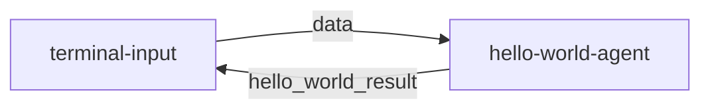

# **1、MoFA开发框架**

[English](README.md) | [简体中文](README_cn.md)

## **1.1  框架核心手册**  

### **1.1.1 设计理念**

MoFA是一个以组合的方式构建AI智能体的软件框架。使用MoFA，AI智能体可以通过模版方式构建，堆叠的方式组合，形成更强大的超级智能体（Super Agent)。

MoFA 独特的设计类理念是：

- **平凡人做非凡事**：AI 不该是精英和巨头的专属领地。MoFA 让每个人都能驾驭和发展 AI，把不可能变成可能，让平凡人也能创造非凡。
- **Composition AI**：受 Unix 哲学启发，MoFA 以“组合”作为核心原则。你可以像搭积木一样，构建智能体、连接智能体、集成工具，让 AI 变得简单、灵活、强大。
- **Everything Agent**：与绝大多数软件不同，在 MoFA 的世界里，智能体（Agent）就是 AI 时代的应用（Application）。不仅是大语言模型，它可以是代码、脚本、API，甚至是 MoFA 本身。MoFA 不是一个框架，而是一个 Agent 生态。
- **Data Flow**：大多数智能体框架依赖复杂的工作流（WorkFlow），而 MoFA 选择更直观、更强大的数据流（Data Flow）。这种方式让智能体能自由组合、拆解和重用，

### **1.1.2 技术架构图**


# 2. **快速上手指南**

## **2.1 开发环境准备**

### 2.1.1 Python 环境

```bash
# 安装 UV 包管理器 加快mofa安装
pip install uv
```

### **注意**: 
- 本地python环境要纯净，不要多个python版本，否则容易导致Dora-rs运行环境和Mofa安装环境的冲突。
- 如果你的环境使用的是Anaconda / Miniconda，务必将Mofa安装到`Base`环境下，以保证Dora运行环境和Mofa环境的一致。
- 要求python环境 >= 3.10。
- 我们目前已在 WSL（Ubuntu 22.04）和 macOS 上进行了测试。Windows 目前不支持。
### 2.1.2 Rust 环境
```bash
# 安装 Rust
curl --proto '=https' --tlsv1.2 -sSf https://sh.rustup.rs | sh

# 安装 Dora 运行时
cargo install dora-cli # In case of issues, try: `--locked`

# 验证安装
rustc --version
cargo --version
dora --version
```

## 2.2 安装 MoFa

### 2.2.1 Git Clone 方式
```bash
# 克隆仓库
git clone https://github.com/moxin-org/mofa.git
cd mofa/python

# 安装依赖
uv pip install -e . && pip install -e . 
# 其中uv 可以加速安装依赖，而pip install -e . 会将py文件编译为.pyc文件，并且会将mofa安装到当前的python环境中
```

### 2.2.2 Docker 方式
```bash
# 克隆仓库
git clone https://github.com/moxin-org/mofa.git
# 进入docker目录
cd /mofa/python/docker
# 构建镜像
docker build -t mofa -f Dockerfile_x86 .

# 运行容器
docker run -it --rm mofa

# 在容器内验证安装
mofa --help 
```

## **2.3 运行第一个Hello World**


### 2.3.1 启动数据流
```bash
cd  /mofa/python/examples/hello_world

# 启动 Dora 服务
dora up

# 构建并运行数据流
dora build hello_world_dataflow.yml
dora start hello_world_dataflow.yml
```

### 2.3.2 测试交互
```bash
# 在另一个终端运行输入节点
terminal-input

# 输入测试数据
> hello
# 预期输出: hello
```

交互结果示例：

```
root@root hello_world % terminal-input                                           
 Send You Task :  你好
-------------hello_world_result---------------    
你好 
---------------------------------------  
 Send You Task :  你是谁   
-------------hello_world_result---------------    
你是谁    
---------------------------------------
```

## **2.4 5分钟开发第一个应用**


本指南将帮助你快速创建一个基于大语言模型的Agent，遵循hello-world的简单实现方式。

### 2.4.1. 创建Agent项目 (1分钟)

使用 MoFa CLI 创建新的 Agent：
```bash
# 创建新的 Agent 项目
mofa new-agent my-llm-agent
cd my-llm-agent
```

### 2.4.2. 配置环境变量 (1分钟)

创建 `.env.secret` 文件(在Dataflow.yml目录同级进行创建)：
```plaintext
LLM_API_KEY=your_api_key_here
LLM_API_BASE=https://api.openai.com/v1  # 或其他API地址
LLM_MODEL=gpt-3.5-turbo  # 或其他模型名称
```

### 2.4.3. 实现Agent逻辑 (2分钟)

编辑 `agent/main.py`：
```python
from mofa.agent_build.base.base_agent import MofaAgent, run_agent
from openai import OpenAI
import os
from dotenv import load_dotenv

@run_agent
def run(agent: MofaAgent):
    try:
        # 加载环境变量
        load_dotenv('.env.secret')
        
        # 初始化 OpenAI 客户端
        client = OpenAI(
            api_key=os.getenv('LLM_API_KEY'),
            base_url=os.getenv('LLM_API_BASE')
        )
        
        # 接收用户输入
        user_input = agent.receive_parameter('query')
        
        # 调用 LLM
        response = client.chat.completions.create(
            model=os.getenv('LLM_MODEL', 'gpt-3.5-turbo'),
            messages=[
                {"role": "system", "content": "You are a helpful AI assistant."},
                {"role": "user", "content": user_input}
            ],
            stream=False
        )
        
        # 发送输出
        agent.send_output(
            agent_output_name='llm_result',
            agent_result=response.choices[0].message.content
        )
        
    except Exception as e:
        agent.send_output(
            agent_output_name='llm_result',
            agent_result=f"Error: {str(e)}"
        )

def main():
    agent = MofaAgent(agent_name='my-llm-agent')
    run(agent=agent)

if __name__ == "__main__":
    main()
```

### 2.4.4. 创建数据流配置 (1分钟)

在`python/examples/my-llm-agent`创建 `my_llm_dataflow.yml`：
```yaml
nodes:
  - id: terminal-input
    build: pip install -e ../../node-hub/terminal-input
    path: dynamic
    outputs: [data]
    inputs:
      agent_response: my-llm-agent/llm_result

  - id: my-llm-agent
    build: pip install -e ../../agent-hub/my-llm-agent
    path: my-llm-agent
    outputs: [llm_result]
    inputs:
      query: terminal-input/data
    env:
      IS_DATAFLOW_END: true
      WRITE_LOG: true
```
**提示**:
- 切记案例不要和dataflow放到同一个文件夹下,一定保持在不同的文件夹中
- 更改Pyproject.toml 将其中的'include = 'my-llm-agent''改为'include = 'agent''
- 更改Pyproject.toml 将其中的'my-llm-agent.main'改为'agent.main'
### 2.4.5. 运行和测试

```bash
# 启动数据流
dora up
dora build my_llm_dataflow.yml
dora start my_llm_dataflow.yml

# 新开终端测试
terminal-input
> 你好，请介绍一下自己
```

### 2.4.6.代码说明

1. **使用装饰器**
   - 使用 `@run_agent` 装饰器简化代码结构
   - 自动处理循环和异常

2. **简单的输入输出**
   - 接收单个输入参数 `query`
   - 返回单个输出结果 `llm_result`

3. **错误处理**
   - 使用 try-except 捕获异常
   - 记录错误日志
   - 返回错误信息给用户

### 2.4.7.自定义选项

1. **修改系统提示词**
```python
messages=[
    {"role": "system", "content": "你的自定义系统提示词"},
    {"role": "user", "content": user_input}
]
```

2. **更换LLM提供商**
   - 修改 `.env.secret` 中的 API 配置
   - 根据需要调整模型参数

### 2.4.8.注意事项

1. 确保 `.env.secret` 已添加到 `.gitignore`
2. API密钥要妥善保管
3. 保持代码结构简单清晰

## **2.5 Dataflow 详解**

(以hello-world为例)

### 2.5.1. 数据流流程


数据流包含两个节点：
1. **terminal-input**: 终端输入节点，负责接收用户输入
2. **hello-world-agent**: 智能体节点，负责处理输入并返回结果

### 2.5.2. 节点特性
每个节点都是多输入多输出的，并且支持持续流式处理：
- **输入输出持续流动**：类似于 OpenAI 的 stream 模式
- **动态处理**：输入输出通过代码动态控制
- **双向通信**：节点之间可以互相发送消息

### 2.5.3. 关键配置说明

#### 2.5.3.1 IS_DATAFLOW_END
```yaml
env:
  IS_DATAFLOW_END: true
```
- 标记当前节点是否为数据流的最后一个节点
- 当该节点发送消息时，表示整个流程结束
- 流程结束后会自动从头开始新的处理循环

#### 2.5.3.2 WRITE_LOG
```yaml
env:
  WRITE_LOG: true
```
- 启用日志记录功能
- 记录当前节点的所有输入输出
- 日志保存在 `logs/` 目录下
- 日志格式：
  ```log
  2025-03-06 11:31:14,172 - INFO: "hello-world receive data: hello"
  2025-03-06 11:31:14,173 - INFO: "output name: hello_world_result output data: hello"
  ```

### 2.5.4. 数据流示例
```yaml
nodes:
  - id: terminal-input
    build: pip install -e ../../node-hub/terminal-input
    path: dynamic
    outputs: data
    inputs:
      agent_response: hello-world-agent/hello_world_result

  - id: hello-world-agent
    build: pip install -e ../../agent-hub/hello-world
    path: hello-world
    outputs: hello_world_result
    inputs:
      query: terminal-input/data
    env:
      IS_DATAFLOW_END: true
      WRITE_LOG: true
```

### 2.5.5. 处理流程详解
1. 用户通过 terminal-input 输入数据
2. terminal-input 将数据发送给 hello-world-agent
3. hello-world-agent 处理数据并返回结果
4. 结果返回给 terminal-input 显示
5. 由于 IS_DATAFLOW_END=true，流程结束并重新开始

### 2.5.6. 日志文件位置
- `logs/log_hello-world-agent.txt`: 智能体运行日志
- `logs/dora-coordinator.txt`: 协调器日志
- `logs/dora-daemon.txt`: 守护进程日志

### 2.5.7. 最佳实践
1. 使用 WRITE_LOG 调试数据流
2. 合理设置 IS_DATAFLOW_END 控制流程结束
3. 保持输入输出参数类型一致
4. 使用环境变量控制调试模式
5. 定期清理 logs/ 目录中的旧日志

# **3. 高级开发手册**

## 3.1 **构建自定义 Agent**


### 3.1.1 使用模板创建
```bash
mofa new-agent you_agent_name 
```
**提示**:
- 你可以使用 `mofa new-agent --help` 来查看创建Agent的相关信息


### 3.1.2 项目结构
```
my-new-agent/
├── agent/
│   ├── configs/
│   │   └── agent.yml       # 配置文件
│   ├── main.py             # 主程序
│   └── __init__.py
├── tests/
│   └── test_main.py        # 测试代码
├── pyproject.toml          # 依赖配置
└── README.md               # 项目文档
```

### 3.1.3 核心代码示例
```python
from mofa.agent_build.base.base_agent import MofaAgent, run_agent

@run_agent
def run(agent: MofaAgent):
    try:
        # 接收单个agent输入
        task = agent.receive_parameter('task')
        
        # 接收多个agent输入
        receive_datas = agent.receive_parameter(['example_one','example_two'])
        # 结果类似于 {'example_one':'example_one_data','example_two':'example_two_data'}

        # 处理逻辑 你可以把你的逻辑添加到这里
        result = process_task(task)
        
        # 发送输出 确保你的输出是可以被序列化的对象(字符串等)
        agent.send_output(
            agent_output_name='agent_result',
            agent_result=result
        )
        
    except Exception as e:
        print(str(e))        

def process_task(data: str) -> str:
    """示例处理函数"""
    return f"Processed: {data}"

def main():
    agent = MofaAgent(agent_name='my-new-agent')
    run(agent=agent)

if __name__ == "__main__":
    main()
```


