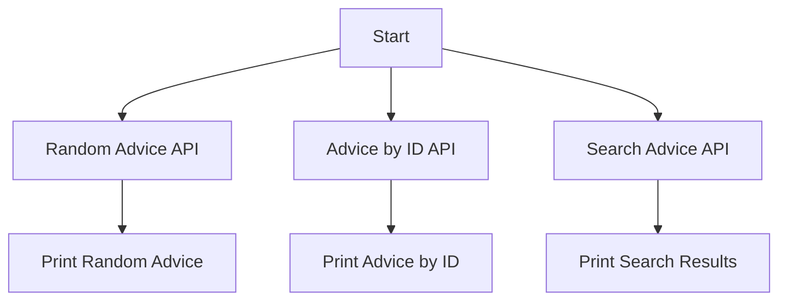

# Advice Slip API Integration

This project demonstrates how to interact with the Advice Slip JSON API to fetch random advice, advice by ID, and search for advice based on a query.

## Features

1. **Random Advice**: Fetches a random piece of advice from the API.
2. **Advice by ID**: Retrieves a specific piece of advice using its unique ID.
3. **Search Advice**: Searches for advice containing a specific keyword or phrase.

## Installation

Ensure you have Python installed, along with the `requests` library:
```bash
pip install requests
```

## Usage

### 1. Random Advice
```python
import requests

url = "https://api.adviceslip.com/advice"
response = requests.get(url)

if response.status_code == 200:
    data = response.json()
    print(f"Advice #{data['slip']['id']}: {data['slip']['advice']}")
else:
    print(f"Request failed with status code: {response.status_code}")
```

### 2. Advice by ID
```python
import requests

slip_id = "42"
url = f"https://api.adviceslip.com/advice/{slip_id}"
response = requests.get(url)

if response.status_code == 200:
    data = response.json()
    print(f"Advice #{data['slip']['slip_id']}: {data['slip']['advice']}")
else:
    print(f"Request failed with status code: {response.status_code}")
```

### 3. Search Advice
```python
import requests

query = "confidence"
url = f"https://api.adviceslip.com/advice/search/{query}"
response = requests.get(url)

if response.status_code == 200:
    data = response.json()
    print(f"Found {data['total_results']} results:")
    for slip in data['slips']:
        print(f"- {slip['advice']}")
else:
    print(f"Request failed with status code: {response.status_code}")
```

## Mermaid Workflow



## Input/Output

- **Input**: None for random advice, `slip_id` for advice by ID, `query` for search.
- **Output**: JSON response containing the advice or search results.

## Error Handling

- The code checks the HTTP status code and prints an error message if the request fails.

## Dependencies

- Python 3.x
- `requests` library

## Contributing

Feel free to fork this project and submit pull requests for improvements or additional features.