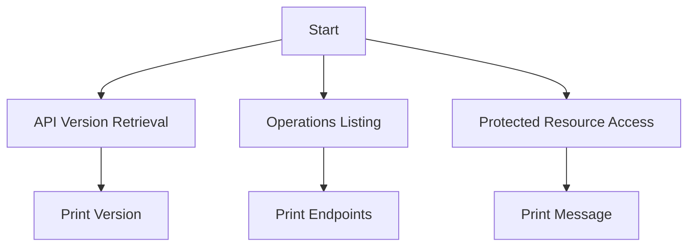

# FOAAS API Client Documentation

This document provides a concise overview of interacting with the FOAAS (F*** Off As A Service) API using Python. The API offers humorous and demonstrative endpoints to illustrate REST concepts.

## Features

1. **API Version Retrieval**: Fetch the current version of the FOAAS API.
2. **Operations Listing**: Retrieve a list of available API endpoints (HATEOAS principles).
3. **Protected Resource Access**: Access secured endpoints using OAuth 2.0 and JWT tokens.

## Usage

### 1. API Version Retrieval
```python
import requests

url = "https://www.foaas.com/version"
response = requests.get(url, headers={"Accept": "application/json"})

if response.status_code == 200:
    version_data = response.json()
    print(f"API Version: {version_data.get('version')}")
else:
    print(f"Request failed: {response.status_code}")
```

### 2. Operations Listing
```python
import requests

url = "https://www.foaas.com/operations"
response = requests.get(url, headers={"Accept": "application/json"})

if response.status_code == 200:
    operations = response.json()
    for op in operations.get('operations', []):
        print(op.get('url'))
else:
    print(f"Request failed: {response.status_code}")
```

### 3. Protected Resource Access
```python
import requests

url = "https://www.foaas.com/protected-resource"
headers = {
    "Authorization": "Bearer YOUR_ACCESS_TOKEN",
    "Accept": "application/json"
}

response = requests.get(url, headers=headers)

if response.status_code == 200:
    data = response.json()
    print(data.get('message'))
else:
    print(f"Request failed: {response.status_code}")
```

## Input/Output Specifications

- **Input**:
  - For authenticated endpoints, a valid JWT token is required in the `Authorization` header.
  - All requests must include the `Accept: application/json` header.

- **Output**:
  - JSON responses containing API version, available operations, or protected resource data.

## Mermaid Workflow Diagram



## Notes

- Replace `YOUR_ACCESS_TOKEN` with a valid JWT token for accessing protected resources.
- Ensure the `requests` library is installed (`pip install requests`).