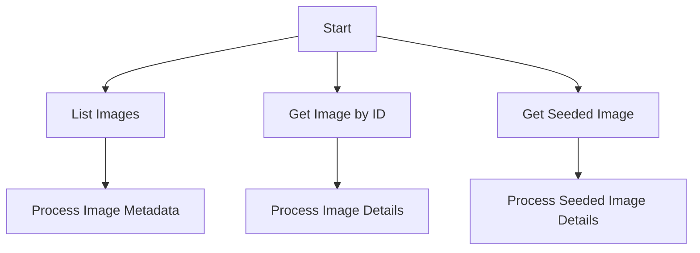

# Picsum API Integration Documentation

This document provides a technical overview of the Picsum API integration, including endpoints, usage examples, and response handling.

## API Endpoints

1. **List Images (`/v2/list`)**
   - **Description**: Retrieves a paginated list of placeholder images with metadata.
   - **Parameters**:
     - `limit` (optional): Number of images to return (default: 30).
   - **Response**: JSON array containing image metadata (ID, author, dimensions, URLs).
   - **Example**:
     ```python
     import requests
     url = "https://picsum.photos/v2/list?limit=5"
     response = requests.get(url)

     if response.status_code == 200:
         images = response.json()
         for image in images:
             print(f"Image ID: {image['id']} by {image['author']}")
     else:
         print(f"Request to {url} failed with status code: {response.status_code}")
     ```

2. **Image Details by ID (`/id/{id}/info`)**
   - **Description**: Retrieves detailed metadata for a specific image by its ID.
   - **Parameters**:
     - `id` (required): Unique identifier of the image.
   - **Response**: JSON object with image details (dimensions, download URL).
   - **Example**:
     ```python
     import requests
     url = "https://picsum.photos/id/0/info"
     response = requests.get(url)

     if response.status_code == 200:
         details = response.json()
         print(f"Dimensions: {details['width']}x{details['height']}")
         print(f"Download URL: {details['download_url']}")
     else:
         print(f"Request to {url} failed with status code: {response.status_code}")
     ```

3. **Seeded Image Details (`/seed/{seed}/info`)**
   - **Description**: Retrieves metadata for a random image generated using a specific seed.
   - **Parameters**:
     - `seed` (required): Seed value for deterministic image generation.
   - **Response**: JSON object with seeded image details (download URL).
   - **Example**:
     ```python
     import requests
     url = "https://picsum.photos/seed/picsum/info"
     response = requests.get(url)

     if response.status_code == 200:
         details = response.json()
         print(f"Seeded image URL: {details['download_url']}")
     else:
         print(f"Request to {url} failed with status code: {response.status_code}")
     ```

## Workflow Diagram



## Usage Notes
- Ensure the `requests` library is installed (`pip install requests`).
- Handle exceptions for network errors or invalid responses.
- Refer to the [Picsum API documentation](https://picsum.photos/) for additional details.