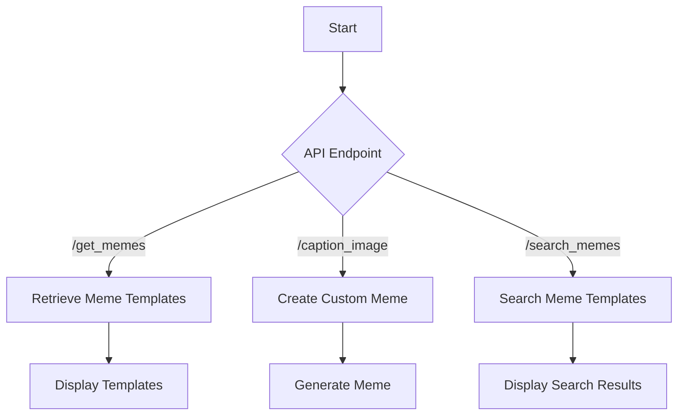

# Imgflip API Integration

This project demonstrates the integration of the Imgflip API to retrieve, create, and search meme templates programmatically.

## Features
1. **Retrieve Popular Meme Templates**: Fetch an array of popular meme templates available for captioning.
2. **Create Custom Memes**: Generate memes by adding text captions to templates.
3. **Search Meme Templates (Premium)**: Search through Imgflip's database of 1M+ meme templates.

## API Endpoints

### `/get_memes`
- **Description**: Retrieves an array of popular meme templates.
- **Method**: `GET`
- **Response**: JSON array of meme templates with details like `name` and `url`.

### `/caption_image`
- **Description**: Creates custom memes by adding text captions to templates.
- **Method**: `POST`
- **Parameters**:
  - `template_id`: ID of the meme template.
  - `username`: Imgflip username.
  - `password`: Imgflip password.
  - `text0`, `text1`: Text captions for the meme.
- **Response**: JSON with the generated meme URL if successful.

### `/search_memes` (Premium)
- **Description**: Searches through Imgflip's database of meme templates.
- **Method**: `POST`
- **Parameters**:
  - `username`: Premium Imgflip username.
  - `password`: Premium Imgflip password.
  - `query`: Search term.
- **Response**: JSON array of matching meme templates.

## Usage

### Retrieve Meme Templates
```python
import requests

url = "https://api.imgflip.com/get_memes"
response = requests.get(url)

if response.status_code == 200:
    data = response.json()
    for meme in data['data']['memes']:
        print(f"{meme['name']}: {meme['url']}")
else:
    print(f"Request failed with status code: {response.status_code}")
```

### Create a Custom Meme
```python
import requests

url = "https://api.imgflip.com/caption_image"
payload = {
    'template_id': '61579',
    'username': 'YOUR_USERNAME',
    'password': 'YOUR_PASSWORD',
    'text0': 'Using the Imgflip API',
    'text1': 'To generate memes programmatically'
}

response = requests.post(url, data=payload)

if response.status_code == 200:
    data = response.json()
    if data['success']:
        print(f"Meme created at: {data['data']['url']}")
else:
    print(f"Request failed with status code: {response.status_code}")
```

### Search Meme Templates (Premium)
```python
import requests

url = "https://api.imgflip.com/search_memes"
payload = {
    'username': 'PREMIUM_USERNAME',
    'password': 'PREMIUM_PASSWORD',
    'query': 'happy'
}

response = requests.post(url, data=payload)

if response.status_code == 200:
    data = response.json()
    if data['success']:
        for meme in data['data']['memes']:
            print(f"{meme['name']} ({meme['id']})")
else:
    print(f"Request failed with status code: {response.status_code}")
```

## Mermaid Workflow



## Input/Output Specifications

### Inputs
- **Username/Password**: Credentials for Imgflip API access.
- **Template ID**: Identifier for the meme template.
- **Text Captions**: Custom text for the meme.
- **Search Query**: Term to search for in meme templates.

### Outputs
- **Meme Templates**: JSON array of templates with names and URLs.
- **Generated Meme URL**: URL of the newly created meme.
- **Search Results**: JSON array of matching meme templates.
