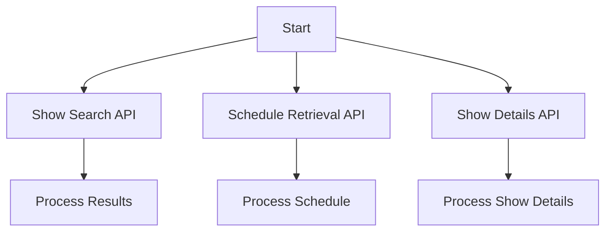

# TVmaze API Integration

This project provides Python code snippets to interact with the TVmaze API, which offers comprehensive TV show data including search, schedule information, and detailed show/episode metadata.

## Features
1. **Show Search**: Search for TV shows by name.
2. **Schedule Retrieval**: Retrieve TV schedules by country and date.
3. **Show Details**: Fetch detailed information about a specific TV show by its ID.

## Code Snippets

### 1. Show Search API
```python
import requests
url = "https://api.tvmaze.com/search/shows"
params = {'q': 'stranger things'}  # Search for popular sci-fi show

response = requests.get(url, params=params)

if response.status_code == 200:
    shows = response.json()
    # Process results to display show names and premier years
    # Example: for show in shows:
    #    print(f"{show['show']['name']} ({show['show']['premiered'][:4]})")
else:
    print(f"Search failed with status code: {response.status_code}")
```

### 2. Schedule Retrieval API
```python
import requests
from datetime import date

url = "https://api.tvmaze.com/schedule"
params = {
    'country': 'US',
    'date': date.today().isoformat()  # Get today's schedule
}

response = requests.get(url, params=params)

if response.status_code == 200:
    schedule = response.json()
    # Process schedule to list episode names and airtimes
    # Example: for episode in schedule:
    #    print(f"{episode['name']} at {episode['airtime']}")
else:
    print(f"Schedule request failed with status code: {response.status_code}")
```

### 3. Show Details API
```python
import requests
show_id = 82  # Example ID for "Game of Thrones"
url = f"https://api.tvmaze.com/shows/{show_id}"

response = requests.get(url)

if response.status_code == 200:
    show_data = response.json()
    # Access show details like genre, summary, and rating
    # Example: print(f"Genre: {show_data['genres'][0]}")
    #          print(f"Rating: {show_data['rating']['average']}")
else:
    print(f"Show request failed with status code: {response.status_code}")
```

## Mermaid Diagram


## Input/Output Specifications
- **Show Search API**:
  - Input: Query string (`q`).
  - Output: List of shows with names and premier years.
- **Schedule Retrieval API**:
  - Input: Country code (`country`) and date (`date`).
  - Output: List of episodes with names and airtimes.
- **Show Details API**:
  - Input: Show ID (`show_id`).
  - Output: Show details including genre, summary, and rating.

## Usage
1. Install the `requests` library if not already installed:
   ```bash
   pip install requests
   ```
2. Copy the relevant code snippet into your Python environment.
3. Modify the parameters as needed (e.g., search query, country, date, or show ID).
4. Run the script to fetch and process the data.

## Contribution
Feel free to contribute by adding more features or improving the existing code. Submit a pull request with your changes.