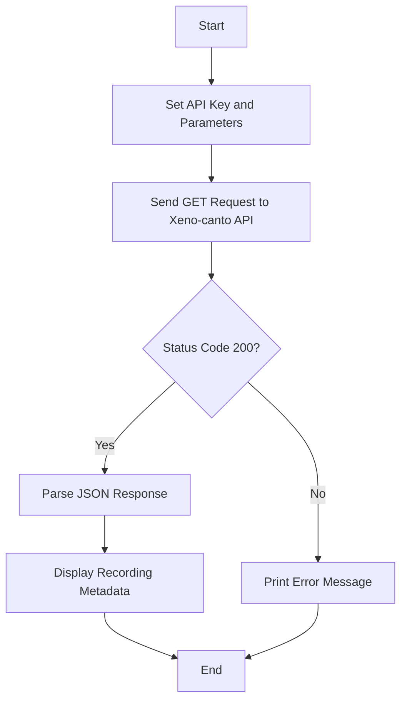

# Xeno-canto API v3 Integration

This Python script demonstrates how to interact with the Xeno-canto API v3 to search and retrieve metadata about wildlife sound recordings. The script queries recordings of Eurasian Wrens in Spain and displays basic information such as recording ID, species name, date, location, and audio URL.

## Features
- **Search Functionality**: Query recordings based on species and location.
- **Metadata Retrieval**: Fetch details like recording ID, species name, date, and location.
- **Audio URL**: Direct link to the audio file for each recording.

## Usage
1. **API Key**: Replace `your_api_key_here` with your actual API key from [xeno-canto.org/account](https://xeno-canto.org/account).
2. **Query Parameters**: Modify the `params` dictionary to customize your search (e.g., change species or location).
3. **Run the Script**: Execute the script to fetch and display recording metadata.

### Example Output
```
Recording 12345: Eurasian Wren
Date: 2022-05-15, Location: Sierra de Guadarrama
Audio URL: https://example.com/audio.mp3
```

## Code Explanation
1. **API Request**: The script sends a GET request to the Xeno-canto API endpoint with specified query parameters.
2. **Response Handling**: If the request is successful (status code 200), the JSON response is parsed to extract recording details.
3. **Output**: Basic information for each recording is printed to the console.

### Dependencies
- `requests`: Used for making HTTP requests to the API.

Install it using:
```bash
pip install requests
```

## Error Handling
- The script checks the HTTP status code and prints an error message if the request fails.

## Mermaid Workflow


## Input/Output
- **Input**: API key, query parameters (species, location, etc.).
- **Output**: Recording metadata (ID, species, date, location, audio URL).