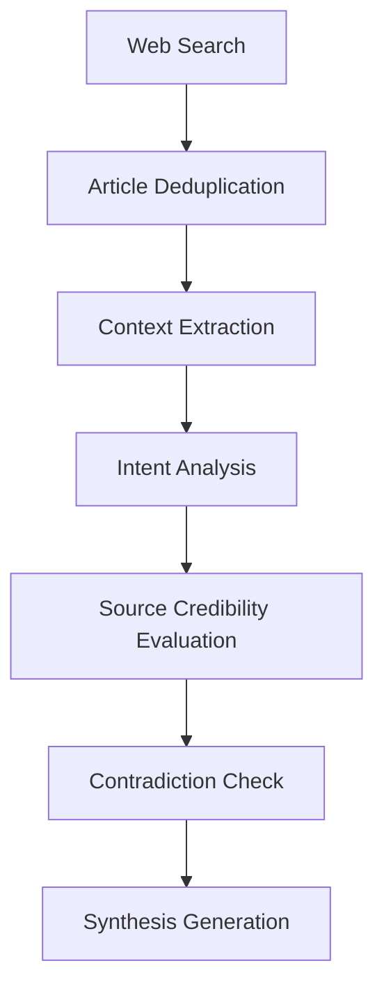

# Deep-Inquire Research Agent

Professional-grade research analysis tool based on multi-stage LLM reasoning

## Core Process 🧠

### 1. Intelligent Search Phase
```python
# Example search call
raw_articles = search_web_with_serper(query="LLM security protection", subscription_key=os.getenv("SERPER_API_KEY"))
```

### 2. Multi-stage Reasoning Process


#### Stage Descriptions:
1. **Context Extraction**: Extract key information fragments
2. **Intent Analysis**: Analyze user's deep requirements
3. **Source Evaluation**: Sort by credibility (Academic > Technical Report > Web)
4. **Contradiction Check**: Cross-verify information consistency
5. **Synthesis Generation**: Integrate final research report

## Output Specifications 📊

### Real-time Thinking Process (thinking type)
```json
{
  "type": "thinking",
  "content": "Analyzing 3 latest papers from arXiv...",
  "articles": [
    {
      "title": "LLM Security Framework",
      "url": "https://example.com/llm-security",
      "snippet": "Proposes novel adversarial training methods...",
      "source": "arxiv",
      "relevance": 0.92
    }
  ],
  "metadata": {
    "stage": "context_extraction"
  }
}
```

### Content Generation (content type)
```json
{
  "type": "content",
  "content": "Current research indicates...",
  "articles": [
    {
      "title": "AI Security Whitepaper",
      "url": "https://example.com/whitepaper",
      "snippet": "Industry standard recommendations...",
      "source": "report",
      "relevance": 0.88
    }
  ],
  "metadata": {
    "confidence": 0.85
  }
}
```

### Final Report (completion type)
```json
{
  "type": "completion",
  "content": "Comprehensive research conclusion...",
  "metadata": {
    "used_sources": 15,
    "article_ids": [
      "https://example.com/paper1",
      "https://example.com/report2"
    ]
  }
}
```

## Environment Configuration ⚙️

1. Create `.env.secret` file:
```ini
SERPER_API_KEY=your_serper_key
LLM_API_KEY=sk-your-openai-key
LLM_BASE_URL=https://api.openai.com/v1
LLM_MODEL_NAME=gpt-4-turbo
```

2. Install dependencies:
```bash
poetry install
```

## Output Field Specifications 🔍
| Field         | Description                      | Example Value               |
|---------------|----------------------------------|-----------------------------|
| type          | Result type (thinking/content/completion) | "thinking"              |
| content       | Generated content                | Research analysis text     |
| articles      | Reference articles               | Contains title/URL/relevance |
| metadata      | Stage/confidence metadata        | {"stage": "context_extraction"} |

