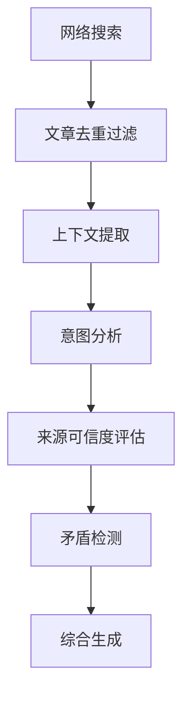

# Deep-Inquire 深度研究代理

基于多阶段LLM推理的专业级研究分析工具

## 核心流程 🧠

### 1. 智能搜索阶段
```python
# 示例搜索调用
raw_articles = search_web_with_serper(query="大语言模型安全防护", subscription_key=os.getenv("SERPER_API_KEY"))
```

### 2. 多阶段推理流程


#### 各阶段说明：
1. **上下文提取**：提取关键信息片段
2. **意图分析**：解析用户深层需求
3. **来源评估**：基于可信度排序（学术期刊 > 技术报告 > 普通网页）
4. **矛盾检测**：交叉验证信息一致性
5. **综合生成**：整合最终研究报告

## 返回结果说明 📊

### 实时思考过程（thinking类型）
```json
{
  "type": "thinking",
  "content": "正在分析来自arXiv的3篇最新论文...",
  "articles": [
    {
      "title": "LLM安全防护框架",
      "url": "https://example.com/llm-security",
      "snippet": "提出新型对抗训练方法...",
      "source": "arxiv",
      "relevance": 0.92
    }
  ],
  "metadata": {
    "stage": "context_extraction"
  }
}
```

### 内容生成片段（content类型）
```json
{
  "type": "content",
  "content": "当前研究显示...",
  "articles": [
    {
      "title": "AI安全白皮书",
      "url": "https://example.com/whitepaper",
      "snippet": "行业标准建议...",
      "source": "report",
      "relevance": 0.88
    }
  ],
  "metadata": {
    "confidence": 0.85
  }
}
```

### 最终报告（completion类型）
```json
{
  "type": "completion",
  "content": "综合研究结论...",
  "metadata": {
    "used_sources": 15,
    "article_ids": [
      "https://example.com/paper1",
      "https://example.com/report2"
    ]
  }
}
```

## 环境配置 ⚙️

1. 创建 `.env.secret` 文件：
```ini
SERPER_API_KEY=your_serper_key
LLM_API_KEY=sk-your-openai-key
LLM_BASE_URL=https://api.openai.com/v1
LLM_MODEL_NAME=gpt-4-turbo
```

2. 安装依赖：
```bash
poetry install
```


## 输出特征说明 🔍
| 字段          | 说明                          | 示例值                      |
|---------------|-------------------------------|----------------------------|
| type          | 结果类型（thinking/content/completion） | "thinking"                |
| content       | 生成内容                      | 研究分析文本                |
| articles      | 参考文章列表                  | 包含标题/URL/相关性等       |
| metadata      | 阶段/置信度等元信息           | {"stage": "context_extraction"} |

