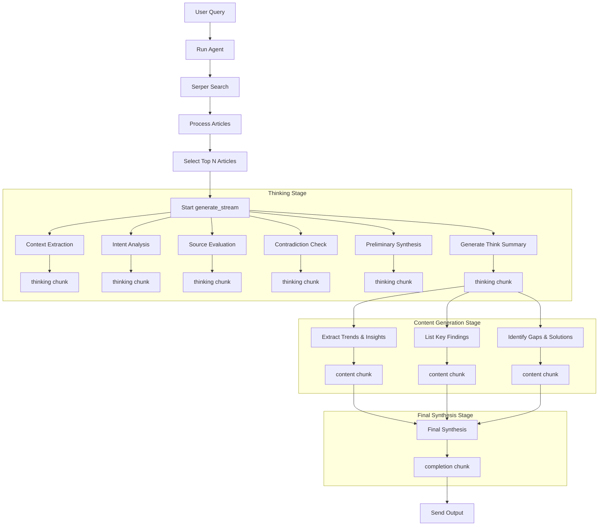

**Project Name: DeepSearch (Deep Research Agent)**

---

## 1. Overview

DeepSearch is an end-to-end, stream-based research agent. Triggered by a user query, it calls an LLM in stages via the `generate_stream` method, performing web retrieval, article processing, multi-stage reasoning, content generation, and final synthesis. The dataflow follows: **Query → Retrieval → Processing → Stage-wise Thinking → Segmented Generation → Final Synthesis**, with each step producing observable `chunk` outputs in real time.

---

## 2. Core dataflow



This dataflow is divided into three main phases:

1. **Thinking Stage**: Using `_llm_think`, it outputs five sub-stage `thinking` chunks and then generates a consolidated Think Summary;
2. **Content Generation Stage**: Based on the Think Summary, it applies three `phase_prompts` sequentially to produce `content` chunks;
3. **Final Synthesis Stage**: It merges all `content` chunks into a final `completion` chunk, marking the end of the streaming output.

---

## 3. Phase Prompts Details

```python
self.phase_prompts = [
    "Based on the current research, what are the most notable trends and insights?",
    "Key findings from the articles reviewed include...",
    "What are the gaps in the current studies and how might they be addressed?",
]
```

* **Prompt 1: Extract Trends & Insights**

  * **Context**: `Think Summary`
  * **Purpose**: Guide the model to highlight common trends and key insights from the research.

* **Prompt 2: List Key Findings**

  * **Context**: `Think Summary`
  * **Purpose**: Instruct the model to enumerate and organize the major findings into a structured list.

* **Prompt 3: Identify Gaps & Solutions**

  * **Context**: `Think Summary`
  * **Purpose**: Help the model detect research gaps and propose potential improvements or future directions.

Each prompt is passed to `_llm_generate_content`, which streams out the corresponding `content` chunk.

---

## 4. Module Overview

### 4.1 `main.py`

```python
from mofa.agent_build.base.base_agent import MofaAgent, run_agent
from mofa.kernel.tools.web_search import search_web_with_serper
from deep_inquire.processor import ArticleProcessor
from deep_inquire.generator import ResearchGenerator
import json

@run_agent
def run(agent: MofaAgent):
    user_query = agent.receive_parameter('user_query')
    raw_articles = search_web_with_serper(query=user_query)
    processed = ArticleProcessor(raw_articles).process()
    generator = ResearchGenerator(processed[:20])
    for chunk in generator.generate_stream(user_query=user_query):
        agent.send_output('deep_search_result', json.dumps(chunk))
```

* **Function**: Starts the agent, retrieves articles, processes them, and streams out each `chunk` via `generate_stream`.

### 4.2 `ArticleProcessor` (`deep_inquire/processor.py`)

```python
class ArticleProcessor:
    def __init__(self, serper_results):
        # Wrap raw results into ArticleRef
    def process(self):
        # Remove duplicates and sort by snippet length
```

* **Responsibility**: URL deduplication and quality ranking (snippet length or custom metric).

### 4.3 `ResearchGenerator` (`deep_inquire/generator.py`)

```python
class ResearchGenerator:
    def generate_stream(self, user_query: str = ''):
        # 1. Thinking stages (_llm_think)
        # 2. Think Summary (_think_summary)
        # 3. Content Generation (_llm_generate_content)
        # 4. Final Synthesis (_llm_generate_content type='completion')
```

* **Features**:

  1. **Thinking Stage**: Five sub-stages of reasoning;
  2. **Content Generation Stage**: Three prompt-driven outputs;
  3. **Final Synthesis**: Merge and mark completion.

---

## 5. Example `chunk` Format

| Field      | Description                                   | Example                          |
| ---------- | --------------------------------------------- | -------------------------------- |
| `type`     | Chunk type: `thinking`/`content`/`completion` | `"thinking"`                     |
| `content`  | The text output from the LLM                  | `"Model reasoning snippet..."`   |
| `articles` | List of article metadata used                 | `[{"title":"...","url":"..."}]`  |
| `metadata` | Extra info, e.g., current stage               | `{"stage":"Context Extraction"}` |
| `id`       | Unique identifier: stageID-substepID          | `"0-1"`                          |
| `end`      | End flag, only present in final chunk         | `"yes"`                          |

---

