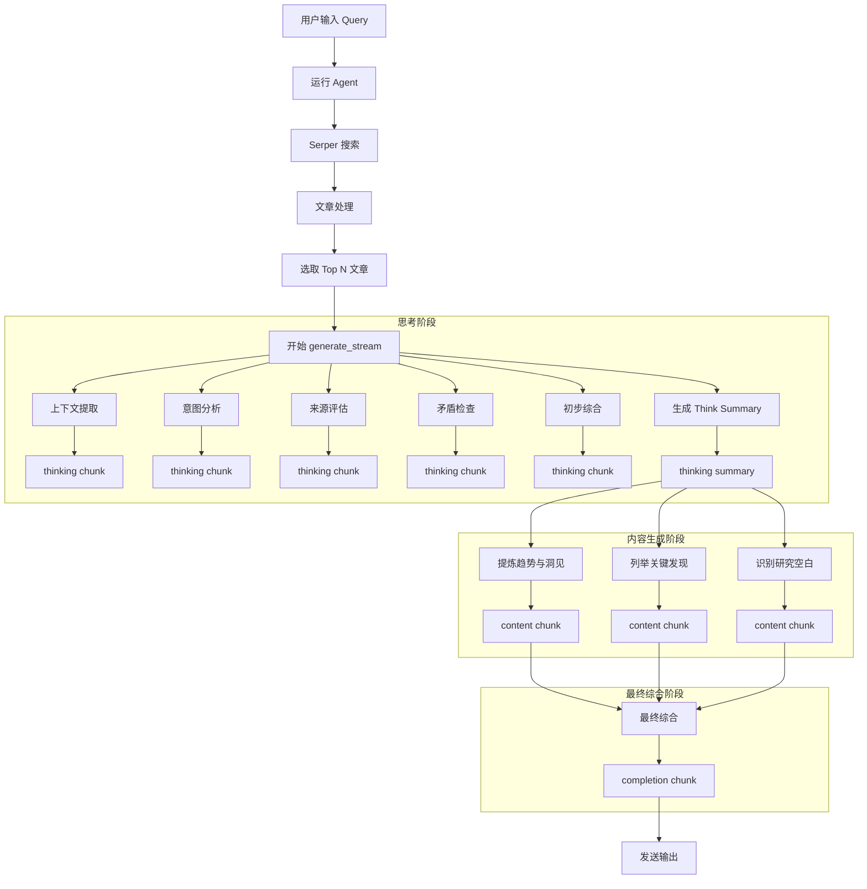

**项目名称：DeepSearch（深度调研代理）**

---

## 一、项目概述

DeepSearch 是一个端到端流式化研究代理，以用户查询为触发，通过 `generate_stream` 方法分阶段调用 LLM，实现从信息检索到深度思考再到报告生成的全过程。整个流程严格按照“查询 → 检索 → 处理 → 分阶段思考 → 分步生成 → 最终综合”设计，确保每一步都能实时产出可观察的 `chunk` 数据。

---

## 二、核心流程



以上流程分为三个主要阶段：

1. **思考阶段**：使用 `_llm_think` 输出五个子阶段的 `thinking` 类型 `chunk`，最后生成 `Think Summary`；
2. **内容生成阶段**：基于 `Think Summary`，依次调用三条 `phase_prompts`，输出 `content` 类型 `chunk`；
3. **最终综合阶段**：整合所有 `content`，产生 `completion` 类型 `chunk` 并结束流式输出。

---

## 三、阶段提示（phase\_prompts）详解

```python
self.phase_prompts = [
    "Based on the current research, what are the most notable trends and insights?",
    "Key findings from the articles reviewed include...",
    "What are the gaps in the current studies and how might they be addressed?",
]
```

* **Prompt1（提炼趋势与洞见）**

  * **上下文**：`Think Summary`
  * **作用**：提炼研究中的共性趋势和核心洞见

* **Prompt2（列举关键发现）**

  * **上下文**：`Think Summary`
  * **作用**：罗列各篇文章中的重要发现，形成结构化列表

* **Prompt3（识别研究空白）**

  * **上下文**：`Think Summary`
  * **作用**：识别当前研究的不足并提出改进建议

以上提示通过 `_llm_generate_content` 方法调用 LLM，实时输出对应的 `content` `chunk`。

---

## 四、模块概览

### 1. `main.py`

```python
from mofa.agent_build.base.base_agent import MofaAgent, run_agent
from mofa.kernel.tools.web_search import search_web_with_serper
from deep_inquire.processor import ArticleProcessor
from deep_inquire.generator import ResearchGenerator
import json

@run_agent
def run(agent: MofaAgent):
    user_query = agent.receive_parameter('user_query')
    raw_articles = search_web_with_serper(query=user_query)
    processed = ArticleProcessor(raw_articles).process()
    generator = ResearchGenerator(processed[:20])
    for chunk in generator.generate_stream(user_query=user_query):
        agent.send_output('deep_search_result', json.dumps(chunk))
```

* **功能**：启动 Agent，检索文章，处理列表，调用 `generate_stream` 并流式发送 `chunk`。

### 2. `ArticleProcessor`（`deep_inquire/processor.py`）

```python
class ArticleProcessor:
    def __init__(self, serper_results):
        # 将原始结果封装为 ArticleRef
    def process(self):
        # 去重，并按 snippet 长度降序
```

* **职责**：URL 去重、质量排序（snippet 长度或自定义指标）。

### 3. `ResearchGenerator`（`deep_inquire/generator.py`）

```python
class ResearchGenerator:
    def generate_stream(self, user_query: str = ''):
        # 1. 思考阶段 (_llm_think)
        # 2. 思考摘要 (_think_summary)
        # 3. 内容生成 (_llm_generate_content)
        # 4. 最终综合 (_llm_generate_content type=completion)
```

* **特点**：

  1. **思考阶段**：五个子阶段分块思考；
  2. **内容生成阶段**：三条提示分段输出；
  3. **最终综合**：整合并标记结束。

---

## 五、示例 `chunk` 结构

| 字段       | 含义                                    | 示例                             |
| -------- | ------------------------------------- | ------------------------------ |
| type     | 块类型：`thinking`/`content`/`completion` | "thinking"                     |
| content  | LLM 输出文本                              | "模型思考片段..."                    |
| articles | 关联文章元数据列表                             | \[{"title":"...","url":"..."}] |
| metadata | 额外信息，如当前阶段                            | {"stage":"上下文提取"}              |
| id       | 阶段ID-子步骤ID                            | "0-1"                          |
| end      | 结束标志，仅在 `completion` 阶段               | "yes"                          |

