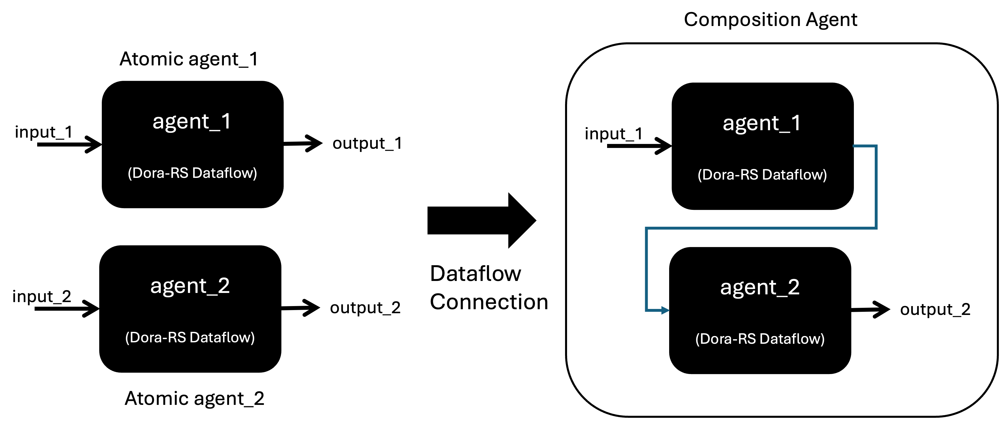

# MoFA with DoRA

[English](README.md) | [简体中文](README_cn.md)

### DORA

[DORA](https://github.com/dora-rs/dora) is an open-source project implementing a dataflow-oriented middleware,  designed to simplify and streamline the creation of AI-based robotic applications. It provides low-latency, composable, and distributed dataflow functionality. Applications are modeled as directed graphs, also known as Pipelines. DORA naturally offers a multi-agent, multi-process computation environment, as well as a foundation for modularity and composability. MoFA uses DORA as its executor to establish the Agent framework.

### MoFA Agent Templates

There are specific design patterns for building agents, and MoFA offers a series of implementations of these design patterns as templates for developers to use.

[Design Patterns ](templates/design_patterns.md)

- [Reasoner](templates/reasoner_template.md)
- [Self Refine](templates/self_refine_template.md)
- [Crewai](templates/crewai_template.md)
- ...

### MoFA Composite Agents

MoFA agents built on the Dora-RS framework essentially operate as Dora-RS Dataflows. Two agents can be combined via data connections, forming composite agents.



The self_refine Agent template mentioned above and the service agents and examples described below are all MoFA composite agents.

### MoFA Service Agents

Agents often require certain services, such as retrieval-augmented generation (RAG), memory, external tool usage, and task planning/decomposition. MoFA follows the principle of "Everything is an Agent." It provides RAG agents, memory agents, planning agents, and action agents as MoFA agents. Developers can connect these pre-implemented service agents to their own agents to gain these services. MoFA also integrates third-party service agents for developers to use based on their needs.

- RAG
- Memory
- Action
- Planning

### Command Line

In general, you can use the Dora-RS command line to run agents:

1. Install the MoFA project package.

2. Execute the following command to start the agent process:

   ```sh
   dora up && dora build your_agent_dataflow.yml && dora start your_agent_dataflow.yml --attach
   ```

3. If the first node of the agent dataflow is a dynamic node used for input/output in Dora, open another terminal and run `terminal-input`. Enter the corresponding tasks to start the Agent process.

### Web Services

### Case Studies

- [Hello World: The Simplest End-to-End Process](examples/hello_world.md)
  - [Hello World, With Dora-RS & Template](examples/hello_world_dora.md)
- Composite Agent Examples:
  - [Simplicity AI](../examples/simplicity_ai/README.md)
  - [ArXiv Research](../examples/arxiv_research/README.md)
  - [Agent Fight](../examples/agent_fight/README.md)
  - [Query Assistant](../examples/query_assistant/README.md)
