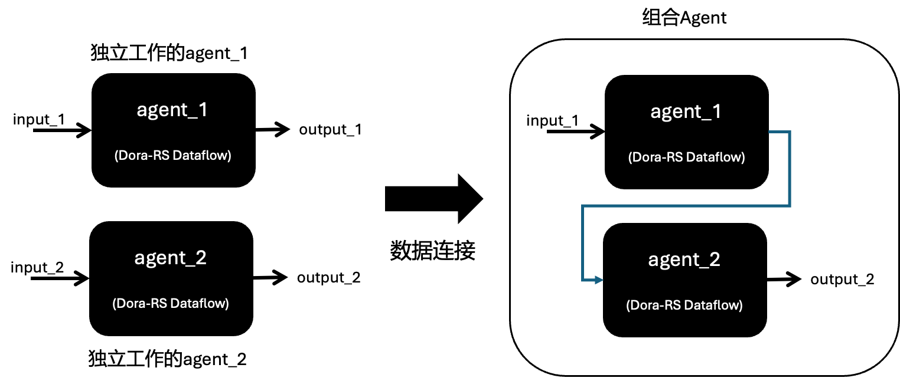

# MoFA with DoRA

### DORA

[DORA](https://github.com/dora-rs/dora)是一个开源项目，实现面向数据流的中间件，旨在简化和简化基于人工智能的机器人应用程序的创建。它提供低延迟、可组合和分布式数据流功能。应用程序被建模为有向图，也称为管道（Pipeline）。DORA为Agent Flow提供了一个天然的多智能体多进程计算环境，以及模块化（Modular)和可组合（Composable）的基础。MoFA以DORA为执行器，建立了Agent框架。

### MoFA智能体模版

构建智能体有一定的设计模式（Design Pattern），MoFA提供一系列的设计模式的实现，供开发者作为模版使用。

- [设计模式](templates/design_patterns.md)
- [reasoner](templates/reasoner_template.md)
- [self_refine](templates/self_refine_template.md)
- [crewai](templates/crewai_template.md)
- ...

### MoFA组合智能体

基于Dora-RS框架构建的MoFA智能体，实质上就是Dora-RS Dataflow。两个智能体之间可以通过数据连接进行组合，从而形成组合智能体。



在上述的self_refine Agent模版和下面将要介绍的服务智能体和案例，都是MoFA组合智能体。

### MoFA服务智能体

智能体往往需要需要一些服务，包括检索增强生成，记忆，使用外部工具和任务规划和分解等。MoFA认为：Everything Agent。我们以MoFA智能体的方式提供RAG智能体，记忆智能体，规划智能体和行动智能体。开发者可以使用这些已经实现的服务智能体，与自己的智能体相连接组合从而获得相应的服务。MoFA也可以集成第三方的服务智能体，供开发者按照不同的需求使用。

- rag
- memory
- action
- planning


### 命令行

一般而言，可使用Dora-rs命令行运行

1. 安装MoFA项目包。

2. 执行以下命令以启动智能体流程：

   ```bash
   dora up && dora build your_agent_dataflow.yml && dora start your_agent_dataflow.yml --attach
   ```

3. 如果agent dataflow的第一个节点是dora用于输入输出的dynamic node。须启动另一个终端，运行`terminal-input`，然后输入相应任务以启动Agent流程。


### Web服务


### 案例分享

- [Hello World：最简单的端到端流程](examples/hello_world.md)
  - [Hello World, With Dora-RS & Template](examples/hello_world_dora.md)
  - [Hello World, With xMind](examples/hello_world_mofa.md)

- 智能体组合案例
  - [simplicity_ai](../examples/simplicity_ai/README.md)
  - [arXiv_research](../examples/arxiv_research/README.md)
  - [agent_fight](../examples/agent_fight/README.md)
  - [query_assistant](../examples/query_assistant/README.md)
