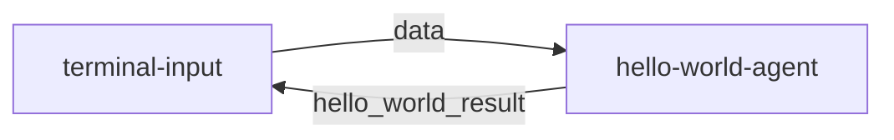

# MoFa 框架使用指南

## 1. 环境准备

### 1.1 Python 环境
```bash
# 安装 UV 包管理器 加快mofa安装
pip install uv
```

**注意**: 
-  如果你的环境是conda的话,由于dora可能在不同系统中对多python环境支持可能存在问题，您需要在默认的base环境安装mofa
- 要求python环境 >= 3.10 

### 1.2 Rust 环境
```bash
# 安装 Rust
curl --proto '=https' --tlsv1.2 -sSf https://sh.rustup.rs | sh

# 安装 Dora 运行时
cargo install dora-cli

# 验证安装
rustc --version
cargo --version
dora --version
```

## 2. 安装 MoFa

### 2.1 Git Clone 方式
```bash
# 克隆仓库
git clone https://github.com/moxin-org/mofa.git
cd mofa/python

# 安装依赖
uv pip install -e .
pip install -e . 
```

### 2.2 Docker 方式
```bash
# 进入docker目录
cd /mofa/python/docker
# 构建镜像
docker build -t mofa -f Dockerfile_x86 .

# 运行容器
docker run -it --rm mofa

# 在容器内验证安装
mofa --help 
```

## 3. 运行 Hello World 示例

### 3.1 启动数据流
```bash
cd  /project/mofa/python/examples/hello_world

# 启动 Dora 服务
dora up

# 构建并运行数据流
dora build hello_world_dataflow.yml
dora start hello_world_dataflow.yml
```

### 3.2 测试交互
```bash
# 在另一个终端运行输入节点
terminal-input

# 输入测试数据
> hello
# 预期输出: hello
```

## 4. 构建自定义 Agent

### 4.1 使用模板创建
```bash
mofa new-agent you_agent_name 
```
**提示**:
- 你可以使用 `mofa new-agent --help` 来查看创建Agent的相关信息


### 4.2 项目结构
```
my-new-agent/
├── agent/
│   ├── configs/
│   │   └── agent.yml       # 配置文件
│   ├── main.py             # 主程序
│   └── __init__.py
├── tests/
│   └── test_main.py        # 测试代码
├── pyproject.toml          # 依赖配置
└── README.md               # 项目文档
```

### 4.3 核心代码示例
```python
from mofa.agent_build.base.base_agent import MofaAgent, run_agent

@run_agent
def run(agent: MofaAgent):
    try:
        # 接收单个agent输入
        task = agent.receive_parameter('task')
        
        # 接收多个agent输入
        receive_datas = agent.receive_parameter(['example_one','example_two'])
        # 结果类似于 {'example_one':'example_one_data','example_two':'example_two_data'}

        # 处理逻辑 你可以把你的逻辑添加到这里
        result = process_task(task)
        
        # 发送输出 确保你的输出是可以被序列化的对象(字符串等)
        agent.send_output(
            agent_output_name='agent_result',
            agent_result=result
        )
        
    except Exception as e:
        agent.logger.error(f"Error: {str(e)}")
        

def process_task(data: str) -> str:
    """示例处理函数"""
    return f"Processed: {data}"

def main():
    agent = MofaAgent(agent_name='my-new-agent')
    run(agent=agent)

if __name__ == "__main__":
    main()
```

### 4.5 Agent-Dataflow的说明(以hello-world为主)


## Dataflow 详解

### 1. 数据流流程


数据流包含两个节点：
1. **terminal-input**: 终端输入节点，负责接收用户输入
2. **hello-world-agent**: 智能体节点，负责处理输入并返回结果

### 2. 节点特性
每个节点都是多输入多输出的，并且支持持续流式处理：
- **输入输出持续流动**：类似于 OpenAI 的 stream 模式
- **动态处理**：输入输出通过代码动态控制
- **双向通信**：节点之间可以互相发送消息

### 3. 关键配置说明

#### 3.1 IS_DATAFLOW_END
```yaml
env:
  IS_DATAFLOW_END: true
```
- 标记当前节点是否为数据流的最后一个节点
- 当该节点发送消息时，表示整个流程结束
- 流程结束后会自动从头开始新的处理循环

#### 3.2 WRITE_LOG
```yaml
env:
  WRITE_LOG: true
```
- 启用日志记录功能
- 记录当前节点的所有输入输出
- 日志保存在 `logs/` 目录下
- 日志格式：
  ```log
  2025-03-06 11:31:14,172 - INFO: "hello-world receive data: hello"
  2025-03-06 11:31:14,173 - INFO: "output name: hello_world_result output data: hello"
  ```

### 4. 数据流示例
```yaml
nodes:
  - id: terminal-input
    build: pip install -e ../../node-hub/terminal-input
    path: dynamic
    outputs: data
    inputs:
      agent_response: hello-world-agent/hello_world_result

  - id: hello-world-agent
    build: pip install -e ../../agent-hub/hello-world
    path: hello-world
    outputs: hello_world_result
    inputs:
      query: terminal-input/data
    env:
      IS_DATAFLOW_END: true
      WRITE_LOG: true
```

### 5. 处理流程详解
1. 用户通过 terminal-input 输入数据
2. terminal-input 将数据发送给 hello-world-agent
3. hello-world-agent 处理数据并返回结果
4. 结果返回给 terminal-input 显示
5. 由于 IS_DATAFLOW_END=true，流程结束并重新开始

### 6. 日志文件位置
- `logs/log_hello-world-agent.txt`: 智能体运行日志
- `logs/dora-coordinator.txt`: 协调器日志
- `logs/dora-daemon.txt`: 守护进程日志

### 7. 最佳实践
1. 使用 WRITE_LOG 调试数据流
2. 合理设置 IS_DATAFLOW_END 控制流程结束
3. 保持输入输出参数类型一致
4. 使用环境变量控制调试模式
5. 定期清理 logs/ 目录中的旧日志

