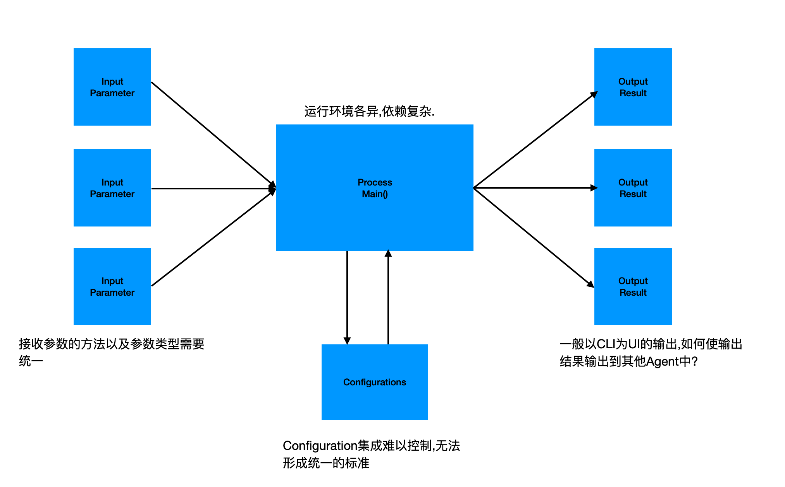
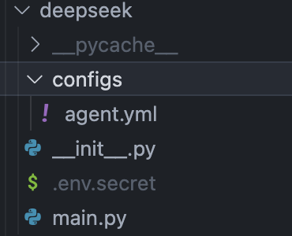
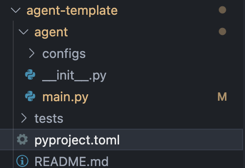

# Low Code Integration

**为什么需要这样的封装？**


### 1. 核心设计理念

我们设计了 `MofaAgent` 类，通过统一的规范，解决了参数输入输出、配置管理及运行环境依赖的问题


### 2. 特性与代码示例

#### 2.1 极简的输入输出接口 

````python:mofa/agent_build/base/base_agent.py
# 接收单个参数
query = agent.receive_parameter('query')
task = agent.receive_parameter('task')

# 接收多个参数
input_datas = agent.receive_parameters(['query','task'])

# 发送结果
agent.send_output('deepseek_result', response)
````
**注意**: 
- receive_parameter返回的结果都是字符串类型
- receive_parameters 返回的结果是dict类型,里面的内容是你接收的参数和返回结果. 例如 {'query':...,'task':...}
- 使用send_output的时候,内部会使用json.dumps()将你的需要发送的数据进行序列化,所以保证你要发送的数据结构都是可以序列化的数据


#### 2.2 极简的配置管理

将配置文件分为两种： 
  - Agent需要配置文件,以`*.yml`为结束
  - Agent需要的密钥文件. 以`.env`为文件开头

````python:agent-hub/deepseek/deepseek/main.py


# 加载环境变量
load_dotenv(agent_config_dir_path + '/.env.secret')

# 读取配置文件
system_prompt = read_yaml(agent_config_dir_path + '/configs/agent.yml')
````


### 3. 极简的构建Agent
这是一个Agent结构目录

当你创建你的Agent的时候,需要构建这样一个目录
- 在pyproject.toml中规范你的依赖以及你的包名
- 在README.md中写明你的Agent的功能以及如何使用,还有一些配置文件的说明
- main.py中是你的Agent的主要逻辑,你需要在这里实现你的Agent的功能.并且如果你有依赖文件的话,都放到这个目录下

以下是一个deepseek的原始代码代码:
```python
# Please install OpenAI SDK first: `pip3 install openai`

from openai import OpenAI

client = OpenAI(api_key="<DeepSeek API Key>", base_url="https://api.deepseek.com")

response = client.chat.completions.create(
    model="deepseek-chat",
    messages=[
        {"role": "system", "content": "You are a helpful assistant"},
        {"role": "user", "content": "Hello"},
    ],
    stream=False
)

print(response.choices[0].message.content)
```


这是一个deepseek-agent的main.py的内容
````python
import json
from mofa.agent_build.base.base_agent import MofaAgent
import os
from dotenv import load_dotenv
from openai import OpenAI
from deepseek import agent_config_dir_path
from mofa.utils.files.read import read_yaml


def main():
    agent = MofaAgent(agent_name='deepseek')
    while True:
        load_dotenv(agent_config_dir_path + '/.env.secret')
        client = OpenAI(api_key=os.getenv('LLM_API_KEY'), base_url="https://api.deepseek.com")
        response = client.chat.completions.create(
            model="deepseek-chat",
            messages=[
                {"role": "system", "content": json.dumps(read_yaml(file_path = agent_config_dir_path + '/configs/agent.yml').get('agent').get('prompt'))},
                {"role": "user", "content":  f"user query: {agent.receive_parameter(parameter_name='query')}  serper search data : {json.dumps(agent.receive_parameter(parameter_name='serper_result'))}"},
            ],
            stream=False
        )
        agent.send_output(agent_output_name='deepseek_result', agent_result=response.choices[0].message.content)
if __name__ == "__main__":
    main()


````

