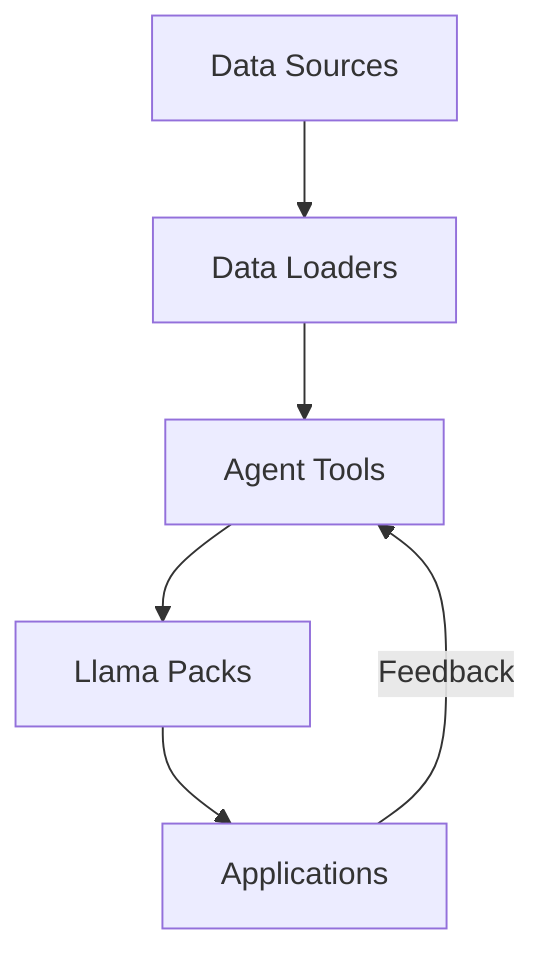

# 主线是怎么做mofa?
我理解您需要准备一个高水平的技术汇报，重点展示LlamaHub相关研究的核心价值。基于您之前的需求，我将从以下几个方面重构汇报框架：

1. **汇报结构设计**：
```markdown
# LlamaHub研究汇报框架

## 1. 核心价值定位
- 解决什么问题
- 创新点在哪里
- 技术突破

## 2. 架构设计
- 整体架构图
- 关键组件
- 数据流设计

## 3. 技术实现
- 核心算法
- 性能优化
- 扩展机制

## 4. 应用场景
- 典型用例
- 效果验证
- 未来方向
```

2. **核心内容要点**：
```markdown
### 1.1 问题定义
- 传统LLM应用的局限性
- 数据接入的挑战
- 任务编排的复杂性

### 1.2 创新点
- 结构化数据接入
- 模块化任务编排
- 可扩展的插件体系

### 2.1 架构图


3. **技术实现示例**：
```python
class ResearchPipeline:
    def __init__(self):
        self.data_loader = DataLoader()
        self.analyzer = ResearchAnalyzer()
        self.visualizer = ResultVisualizer()
    
    def present(self, research_data):
        # 数据加载
        structured_data = self.data_loader.process(research_data)
        
        # 分析处理
        insights = self.analyzer.analyze(structured_data)
        
        # 可视化展示
        presentation = self.visualizer.render(insights)
        
        return presentation
```

4. **汇报策略建议**：
- **时间分配**：技术细节（40%），架构设计（30%），应用价值（30%）
- **重点突出**：创新点、技术突破、实际效果
- **互动设计**：关键节点设置提问环节
- **可视化**：使用架构图、流程图、对比图表

5. **注意事项**：
- 避免过多技术细节，突出核心价值
- 准备2-3个典型用例
- 准备技术对比数据
- 预留5分钟Q&A时间

这个框架旨在：
1. 清晰展示研究价值
2. 突出技术亮点
3. 提供可验证的结果
4. 引导深入讨论

建议准备时长：30分钟核心内容 + 10分钟Q&A
