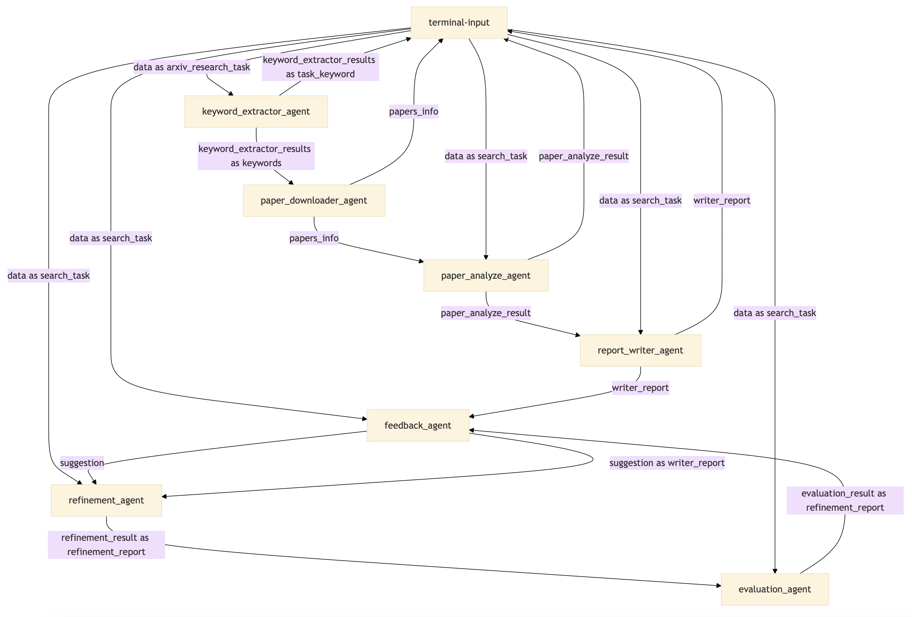

# Arxiv Research 案例

[English](README.md) | [简体中文](README_cn.md)

## 1. 功能说明

Arxiv Research智能体通过从arXiv上获取相关论文，并根据用户的问题生成解决方案。其设计模式为：**关键字提取 + 论文下载 + 论文分析 + 任务报告生成 + 反馈 + 优化 + 评估**。

**流程说明：**

keywords_extractor ：用于从用户任务中提取相关关键词，以优化 arXiv 上学术论文的搜索。根据用户需求提供最多三组关键词检索相关论文。

paper_downloader_agent ：根据关键词在 arXiv 上搜索相关论文，然后根据标题下载相应的论文。

paper_analyze_agent ：使用 RAG 方法将每篇下载的论文上传到向量数据库，提取关键信息，并为每篇论文生成摘要。

report_writer_agent ：将用户的问题与论文摘要结合起来生成报告。

feedback_agent ：根据问题和答案提供建议。

refinement_agent ：根据建议、问题、答案和论文摘要生成更好的答案。

evaluation_agent ：根据问答评估答案是否符合要求。如果答案符合要求，则返回答案。如果没有，请检查迭代次数。如果迭代次数达到阈值，则返回答案。否则，请再次调用feedback_agent提供建议。


## 2. 使用场景

该智能体适用于需要从arXiv上搜索相关学术论文，并根据用户提出的问题生成最佳解决方案的任务。常见的应用场景包括：

- 搜索与特定研究领域相关的最新论文并总结出主要贡献。
- 结合多个研究成果，针对用户的具体问题提出可行性建议。
- 自动生成论文研究报告，辅助科研决策和项目开展。

## 3. 配置方法

### 配置说明

图为构成arxiv research组合Agent的DORA数据流图。



配置文件位于`configs`目录下，`.py`文件为实际运行的智能体代码。配置文件指定了各个Agent的行为、参数和模型提示等。

| **文件**                             | **作用**                                                                 |
| ------------------------------------ | ------------------------------------------------------------------------ |
| `configs/keyword_extractor.yml`      | 配置关键字提取的参数，用于从用户任务中提取相关关键词。                     |
| `configs/paper_downloader_agent.yml` | 配置论文下载的逻辑和arXiv搜索参数。                                       |
| `configs/paper_analyze_agent.yml`    | 配置论文分析逻辑，包括如何上传至VectorStore以及关键信息提取方式。          |
| `configs/report_writer_agent.yml`    | 配置报告生成逻辑，将问题与论文总结结合生成完整的解决方案报告。              |
| `configs/feedback_agent.yml`         | 配置反馈生成机制，根据问题和答案提供优化建议。                             |
| `configs/refinement_agent.yml`       | 配置优化逻辑，结合反馈和论文内容对答案进行优化。                           |
| `configs/evaluation_agent.yml`       | 配置评估标准，评估生成的答案是否符合用户需求。                             |
| `keyword_extractor.py`               | 实际提取用户需求中的关键字。                                               |
| `paper_downloader_agent.py`          | 实际执行论文下载任务，通过arXiv获取相关论文并下载。                        |
| `paper_analyze_agent.py`             | 实际执行论文分析任务，提取论文中的关键信息。                               |
| `report_writer_agent.py`             | 实际生成任务报告，结合论文信息和用户需求给出解决方案。                     |
| `feedback_agent.py`                  | 实际提供反馈建议，帮助优化生成的报告或解决方案。                           |
| `refinement_agent.py`                | 实际执行优化任务，生成基于反馈的优化结果。                                 |
| `evaluation_agent.py`                | 实际执行评估任务，判断结果是否符合需求，并决定是否继续迭代。               |

### 配置步骤


#### 3. 修改配置

根据具体需求，编辑`configs`目录下的`.yml`配置文件。
可以自定义修改里面的模型参数，建议不要修改以及提示词。


## 4. 运行智能体

使用Dora-rs命令行运行

1. 安装MoFA项目包。
2. 执行以下命令以启动智能体流程：
   ```bash
   dora up && dora build arxiv_research_dataflow.yml && dora start arxiv_research_dataflow.yml --attach
   ```
3. 启动另一个终端，运行`terminal-input`，然后输入相应任务以启动Arxiv Research流程。

