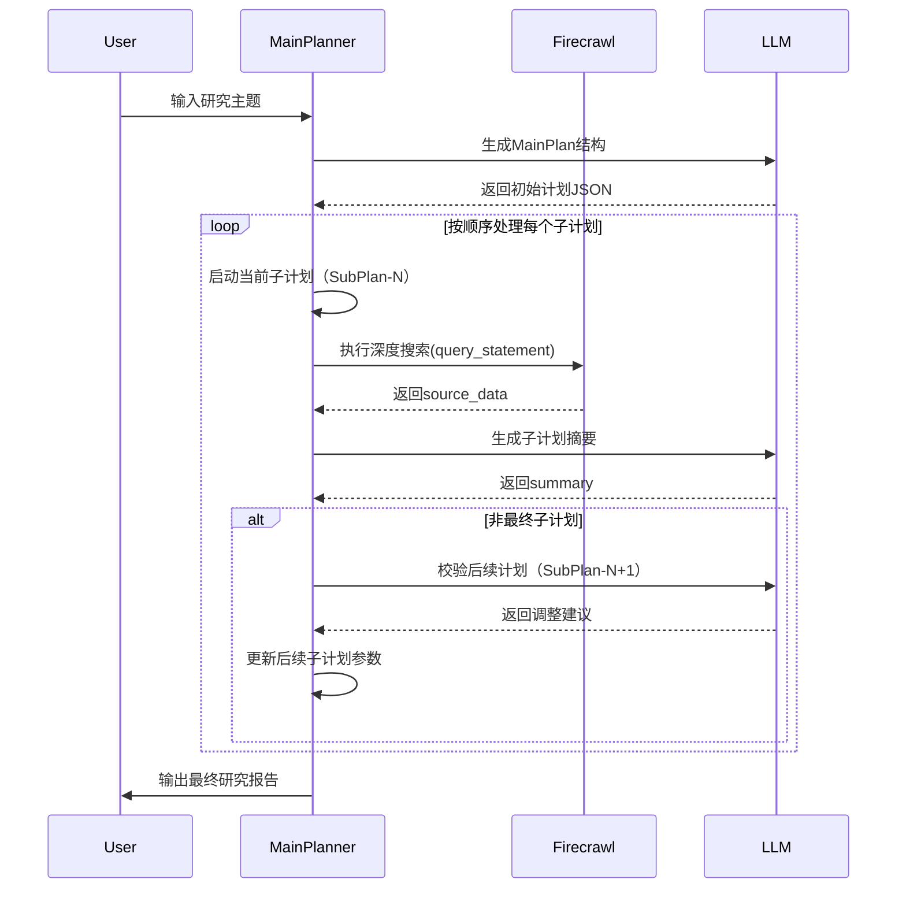
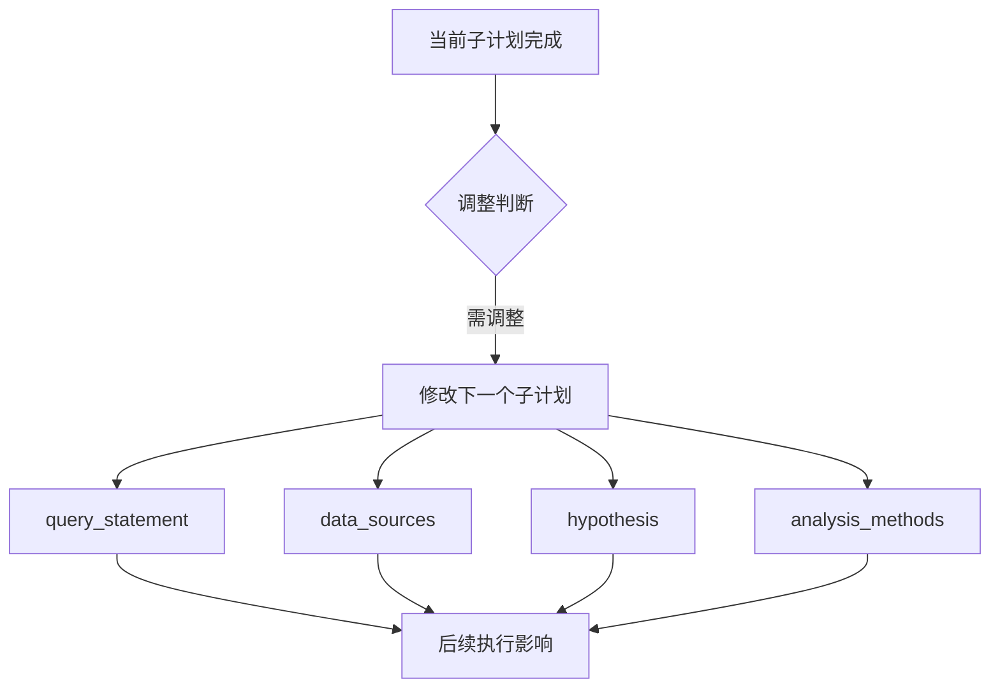

# DeepResearchPlanning 智能研究规划框架

---

## 系统架构与执行流程详解

### 全链路执行时序图


---

## 分阶段执行细节

### 阶段1：主计划生成
```python
def generate_main_plan(user_query):
    # 使用LLM生成结构化研究框架
    response = self._call_llm(user_query)
    # 严格验证数据结构
    self.main_plan = MainPlan(**json.loads(response)) 
    # 示例输出结构
    """
    {
        "core_goal": "量子计算药物研发",
        "sub_plans": [
            { "sub_id": "SP-1", "query_statement": [...]},
            { "sub_id": "SP-2", ...}
        ]
    }
    """
```

### 阶段2：子计划迭代执行
```python
for index, sub_plan in enumerate(main_plan.sub_plans):
    # 执行当前子计划研究（代码片段）
    sub_queries = sub_plan.query_statement
    research_results = []
    
    # 执行每个查询的深度搜索
    for query in sub_queries[:2]:  # 限制最大查询数
        source_data, analysis = firecrawl.deep_research(query)
        research_results.append({
            "query": query,
            "sources": source_data,
            "analysis": analysis
        })
    
    # 绑定研究数据到子计划
    sub_plan.source_urls = [item['url'] for result in research_results for item in result['sources']]
    sub_plan.source_data = research_results
    
    # 生成子计划摘要
    summary = self.create_sub_plan_summary(sub_plan, research_results)
    sub_plan.summary = json.loads(summary)
```

### 阶段3：动态计划调整
```python
# 动态调整下一个子计划（代码逻辑）
if index < len(main_plan.sub_plans)-1:
    next_sub_plan = main_plan.sub_plans[index+1]
    
    # 构建验证提示
    messages = [
        {"role": "system", "content": Sub_Plan_Update},
        {"role": "user", "content": json.dumps({
            "current": sub_plan.dict(),
            "next": next_sub_plan.dict()
        })}
    ]
    
    # 调用LLM进行验证
    adjusted_plan_json = self._call_llm(messages=messages)
    adjusted_plan = SubPlan.parse_raw(adjusted_plan_json)
    
    # 保留sub_id更新计划
    main_plan.sub_plans[index+1] = adjusted_plan.copy(update={"sub_id": next_sub_plan.sub_id})
```

---

## 动态调整机制深度解析

### 调整触发条件
| 触发类型        | 判断条件                                                                 | 调整策略示例                                                                 |
|----------------|-------------------------------------------------------------------------|----------------------------------------------------------------------------|
| 数据驱动调整    | source_data包含关键新发现                                                | 增加后续子计划的特定分析维度                                                 |
| 逻辑断裂调整    | summary显示与后续计划假设矛盾                                            | 修改后续子计划的hypothesis和query_statement                                  |
| 资源限制调整    | source_urls获取数量不足                                                  | 切换数据源或放宽爬取参数                                                     |
| 效率优化调整    | analysis显示某方法效率低下                                               | 更新quantitative_analysis方法                                                |

### 调整参数影响范围


### 典型调整案例
**场景**：SP-1发现量子模拟精度超预期  
```json
// 调整前 SP-2
{
    "sub_id": "SP-2",
    "core_objective": "经典计算方法分析",
    "query_statement": ["传统分子动力学方法"]
}

// 调整后 SP-2
{
    "sub_id": "SP-2",
    "core_objective": "量子-经典计算对比分析",
    "query_statement": ["量子与经典方法效率对比", "精度差异影响因素"],
    "modification_reason": "基于SP-1发现的量子模拟精度优势（92% vs 68%）"
}
```

---

## 数据管理与状态追踪

### 研究过程全记录
| 数据维度         | 存储位置                          | 示例内容                                                                 |
|------------------|----------------------------------|--------------------------------------------------------------------------|
| 原始数据         | SubPlan.source_urls              | ["https://nature.com/quantum-drugs"]                                    |
| 分析过程         | SubPlan.source_data              | 包含每个query的爬取结果和初步分析                                         |
| 研究结论         | SubPlan.summary                  | {"key_findings": "量子算法提升精度24%", "confidence_level": 0.92}        |
| 调整轨迹         | SubPlan.modification_reason      | "增加与SP-3的交叉验证环节"                                                |

### 异常处理机制
```python
# 带重试的执行逻辑（代码片段）
for attempt in range(self.retry_num+1):
    try:
        source_data = firecrawl.deep_research(query)
        break
    except Exception as e:
        if attempt == self.retry_num:
            log.error(f"研究失败: {str(e)}")
            source_data = []
```

---

## 最终输出结构示例

### 完整研究报告
```json
{
    "main_plan": {
        "core_goal": "量子计算在药物研发中的应用",
        "sub_plans": [
            {
                "sub_id": "SP-1",
                "summary": {
                    "key_metrics": {
                        "accuracy_gain": "24%",
                        "confidence_interval": "0.89-0.93"
                    }
                },
                "source_urls": ["https://example.com/paper1"]
            },
            {
                "sub_id": "SP-2",
                "modification_reason": "基于SP-1精度结果扩展对比维度",
                "query_statement": ["量子vs经典计算效率对比"]
            }
        ]
    }
}
```

---

## 架构创新总结

### 核心技术价值
1. **动态演进架构**
   - 实现研究过程的"执行→验证→调整"闭环
   - 保持研究主线的自适应优化能力

2. **结构化知识沉淀**
   - 三级数据容器设计（MainPlan/SubPlan/SourceData）
   - 完整记录研究轨迹和决策依据

3. **智能验证系统**
   - 基于LLM的连续性验证
   - 多维度调整参数支持（15+可调字段）
