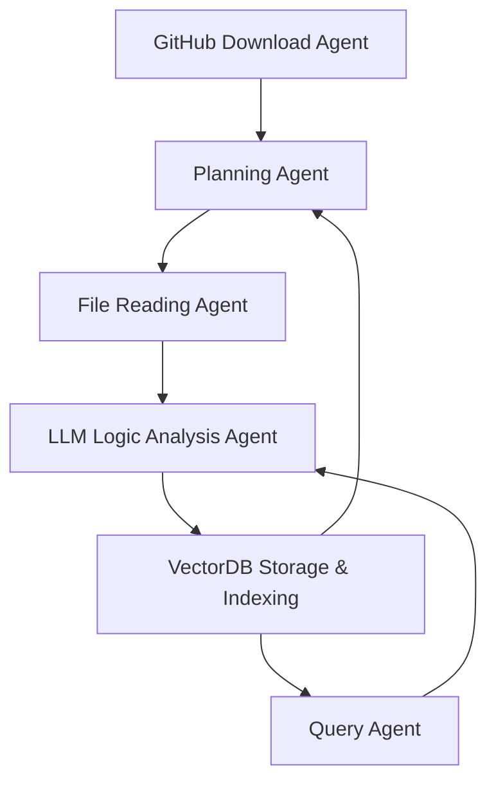

# DeepWiki 系统设计与实现文档

## 🧩 系统概览

DeepWiki 是一个智能文档生成系统，专门用于自动分析 GitHub 上的开源项目，理解其代码结构、模块关系和执行逻辑，并根据分析结果生成易于理解的文档。系统通过解析 GitHub 项目的主程序（如 `main` 函数）和模块依赖，按照程序执行顺序逐层解析代码，最终生成详细的文档和模块描述。所有文档内容将存储在 VectorDB 中，以便高效查询。

## 🛠️ 核心功能模块

### 1. **GitHub 项目下载 Agent（GitHub Download Agent）**

- **功能**：克隆指定的 GitHub 仓库，获取项目的源代码和结构。
- **实现**：
  - 使用 GitHub API 或 Git 命令行工具，自动从 GitHub 下载项目代码。
  - 解析 GitHub 仓库的结构，获取 README 文件、依赖文件（如 `requirements.txt` 或 `package.json`）、配置文件等信息。

### 2. **文档解析与生成（Planning）**

- **功能**：根据 GitHub 仓库中的 README 或其他文档，生成解析计划（Planning），确定需要解析的文件、模块及其执行顺序。
- **实现**：
  - 解析 README 文件，提取项目概述、模块描述、运行逻辑等信息。
  - 生成层次化的解析计划，确保文件解析顺序符合代码执行逻辑（如根据 `main` 函数等主程序结构进行分析）。

### 3. **文件读取 Agent（File Reading Agent）**

- **功能**：根据生成的分析计划，逐步读取 GitHub 项目中的文件，获取代码内容并传递给 LLM 进行分析。
- **实现**：
  - 依据生成的分析计划，从 GitHub 项目中按顺序读取指定的文件（如 `main.py`、`index.js` 等）。
  - 将文件内容传递给 LLM 进行逻辑分析，帮助判断模块的执行逻辑。

### 4. **LLM 逻辑分析 Agent（LLM Logic Analysis Agent）**

- **功能**：分析每个文件的内容，理解代码的运行逻辑，并根据程序控制流（如函数调用、模块导入）判断代码的执行顺序。
- **实现**：
  - LLM 分析每个文件的内容，识别主程序（如 `main` 函数）及其调用关系，理解模块之间的执行顺序。
  - 判断当前文件在项目中的作用，并生成自然语言描述。

### 5. **循环解析与任务调度（Loop Parsing & Task Scheduling）**

- **功能**：根据 LLM 的反馈，系统继续按运行顺序解析下一个文件，直到所有文件都解析完毕。
- **实现**：
  - 计划生成后，系统会进入循环，读取文件内容，并将其传递给 LLM 进行分析。
  - LLM 返回结果后，系统评估当前解析的模块是否为“终结节点”或是否需要进一步解析。
  - 每次分析结果都将存储到 VectorDB 中，以便后续检索和分析。

### 6. **存储与索引（VectorDB Storage & Indexing）**

- **功能**：系统存储解析过的文件内容、模块关系及分析结果，所有内容存储在 VectorDB 中，以支持高效查询。
- **实现**：
  - 使用 VectorDB（如 Pinecone、Weaviate 或 FAISS）存储文件路径、内容、模块关系、任务调度信息等。
  - 使用嵌入技术将文档内容转化为向量，并存储在 VectorDB 中，支持高效的相似度搜索和查询。

### 7. **用户查询 Agent（Query Agent）**

- **功能**：用户通过自然语言输入查询，系统根据存储在 VectorDB 中的文档内容返回相关的答案。
- **实现**：
  - 用户输入自然语言查询，Query Agent 将其传递给 VectorDB，进行相似度检索。
  - 基于返回的文档内容，Query Agent 将信息传递给 LLM，生成用户所需的回答。
  - 如果用户的查询涉及多个模块或文件，Query Agent 会根据需要继续调用相关的文件并提取信息。

------

## 🔄 系统工作流程

1. **接收 GitHub 项目文档**：
   - 用户提供 GitHub 仓库的 URL，系统自动下载项目文件（通过 GitHub API 或 Git 命令行）。
2. **生成分析计划（Planning）**：
   - 系统基于 README 文件、项目描述等信息生成详细的解析计划，明确需要解析的文件和顺序。
   - 根据项目的主程序（如 `main` 函数或入口文件），生成解析顺序。
3. **文件解析与循环分析阶段**：
   - 系统根据解析计划，File Reading Agent 按顺序读取文件内容。
   - 文件内容传递给 LLM 进行逻辑分析，LLM 判断当前文件是否为“终结节点”或是否为下一步解析的模块。
   - 每次解析的结果都会存储到 VectorDB 中，形成文档内容的向量表示。
4. **任务调度与继续解析**：
   - 根据 LLM 的反馈，系统继续解析下一步文件，直到解析完所有模块。
   - 每次解析结果都反馈给系统，循环继续，直到项目解析完成。
5. **存储与索引**：
   - 所有文件路径、内容和解析结果存储到 VectorDB 中，文档内容通过嵌入技术转化为向量，并进行索引。
6. **用户查询与响应**：
   - 用户通过自然语言查询，Query Agent 根据 VectorDB 中的存储内容进行检索。
   - 根据检索到的相关信息，系统生成并返回用户查询的答案。

------

## 📈 架构图示意（Mermaid 图）

以下是更新后的系统架构图，采用 mermaid 图表示，强调 `Planning`、`File Reading`、`LLM Logic Analysis` 和 `Query Agent` 形成一个循环过程，不断根据反馈进行评估和解析。

------

服务。