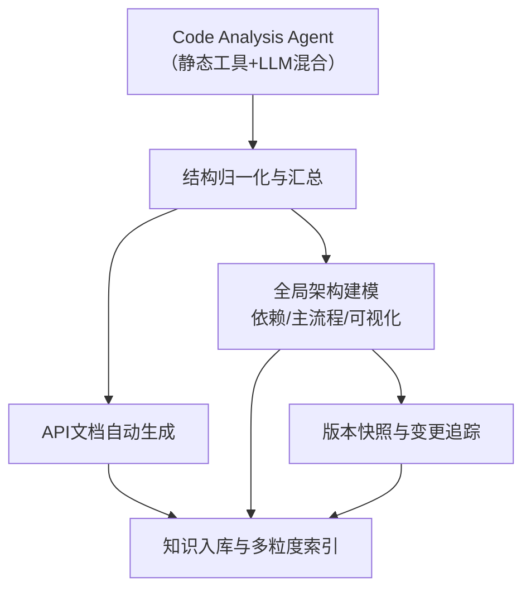
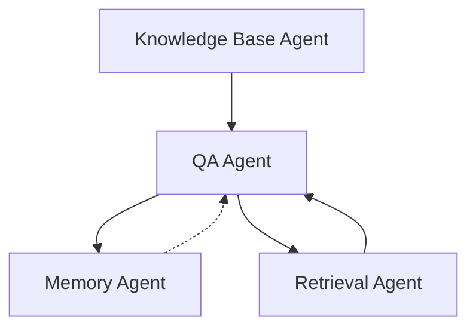

# DeepWiki 智能文档系统详细设计文档

---

## 一、系统愿景与定位

DeepWiki 致力于成为开源项目的“智能结构化解读者”，通过自动化分析、知识建模、智能问答和持续记忆，帮助开发者、产品、测试、运维等角色高效理解和利用项目知识。  
**核心特色**：  
- 智能循环调度与动态补全，持续完善项目知识
- Memory Agent 贯穿问答与分析，支持知识演化与高效追溯
- 深度结构化理解与主流程/依赖链分析，远超传统静态文档工具
- 支持多项目/多语言/多风格，采用“静态工具+LLM”混合范式，灵活适配各种代码库

---

## 二、系统主结构与分层

### 2.1 顶层分层架构

1. **数据采集与解析层**  
   - 拉取源码、结构解析、依赖分析、代码语义分析
2. **知识建模与整理层**  
   - 架构整理、API文档生成、知识库构建、变更追踪
3. **智能服务与交互层**  
   - 智能问答、检索、协作、记忆管理

---

## 三、核心 Agent 及分工

### 3.1 数据采集与解析层

- **Project Fetch Agent**：拉取/同步代码仓库，输出目录树、文件清单
- **Structure Parser Agent**：解析目录结构，识别关键文件
- **Dependency & Entry Analyzer Agent**：检测主入口、分析依赖关系
- **Code Analysis Agent**：静态分析+LLM，提取结构、调用关系、主流程

### 3.2 知识建模与整理层

- **Architecture Generation Agent**：汇总全局结构，生成架构图、依赖图、主流程图
- **API Doc Generation Agent**：自动识别接口、参数、返回值，生成标准API文档

- **Knowledge Base Agent**：统一存储结构化信息、文档，支持多粒度索引与检索

### 3.3 智能服务与交互层

- **QA Agent**：自然语言理解，基于知识库、Memory Agent 和 LLM 生成答案，支持多轮对话和上下文追溯
- **Retrieval Agent**：全文、结构化、相似度等多种检索方式，聚合相关内容
- **Collaboration Agent**：多用户协作、权限分级、评论与标注、任务分配
- **Memory Agent**：  
  - 贯穿问答与分析全过程，记录用户历史提问、答案、分析过程中的决策、已知结构/依赖/主流程等
  - 支持跨会话、跨版本的知识积累和上下文理解，辅助 QA、分析、追溯

---

## 四、运行流程与数据流

### 4.1 总体流程

1. **项目拉取与结构解析**  
   - Project Fetch Agent 拉取源码  
   - Structure Parser Agent 解析目录结构，识别关键文件
2. **依赖与入口分析**  
   - Dependency & Entry Analyzer Agent 检测主入口、分析依赖
3. **代码分析与架构整理**  
   - Code Analysis Agent 静态+语义分析，输出结构化分析结果  
   - Architecture Generation Agent 汇总全局结构，生成架构图、主流程图、依赖链
4. **API文档与知识入库**  
   - API Doc Generation Agent 生成接口文档  

   - Knowledge Base Agent 统一存储所有结构化信息、文档、图谱
5. **智能问答与记忆管理**  
   - 用户提问 → QA Agent 基于知识库+Memory Agent+LLM 生成答案  
   - Memory Agent 记录问答历史、用户偏好、分析过程，辅助上下文理解和持续演化
6. **检索与协作**  
   - Retrieval Agent 支持多种检索方式，聚合内容  
   - Collaboration Agent 支持团队协作、评论、标注、任务分配

---

### 4.2 知识建模与整理层流程图

---

### 4.3 Memory Agent 在问答与分析中的数据流

---

## 五、多项目/多语言/多风格适配策略

### 5.1 自动检测与工具链选择

- **自动检测项目类型/主语言**：通过文件后缀、依赖文件、shebang等自动识别
- **Agent支持多后端/多工具适配**：每个Agent可配置优先级，先尝试静态工具，失败/不全时再调用LLM
- **可插拔工具链**：支持用户为某类项目注册自定义分析器/工具/LLM prompt

### 5.2 静态工具与LLM混合范式

- **主流语言优先用静态工具**（如AST、pyan3、esprima、jedi等），高效、结构化
- **LLM作为兜底/补全/语义理解/多语言适配**，处理工具难以覆盖的场景
- **LLM输出结构化JSON**，便于自动处理和后续流转

---

## 六、DeepWiki 的独特性与核心优势

1. **智能循环调度与动态补全**  
   - 持续完善项目知识，自动补全遗漏，保证架构和知识的完整性
2. **Memory Agent 记忆能力**  
   - 贯穿问答与分析全过程，记忆历史分析、用户交互、主流程、依赖链等，支持跨版本、跨会话的知识演化
3. **深度结构化理解**  
   - 支持主流程追溯、依赖链分析、结构化问答，远超传统静态文档工具
4. **多智能Agent协作与多工具适配**  
   - 分工明确，解耦清晰，支持多语言/多风格/多项目，灵活组合静态工具与LLM

---

## 七、典型用户场景

- **新成员快速了解项目**：通过架构图、主流程、API文档一览全貌，支持结构化问答和主流程追溯
- **开发者定位问题/依赖**：结构化检索、依赖追踪、变更对比，支持代码定位和主流程追溯
- **产品/测试/运维提问**：自然语言问答，获取结构、接口、变更等信息，答案可溯源到具体文档、代码、架构图节点
- **持续演化与知识积累**：Memory Agent 记忆历史分析和决策，支持跨版本、跨会话的知识演化

