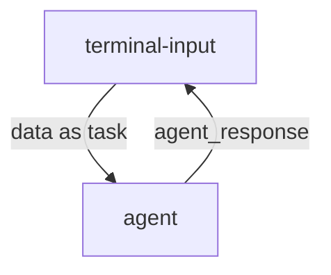

### **技术架构**


### **运行程序**

- 添加环境变量 新建 `.env.secret` 文件，并添加以下内容：
```shell
# 比如使用火山引擎的API KEY
LLM_API_KEY="your_api_key"
LLM_BASE_URL="https://ark.cn-beijing.volces.com/api/v3"
LLM_MODEL_NAME="deepseek-r1-250120"
```

- 安装playwright

```bash
playwright install
```

- 启动数据流

```bash
# 启动数据流
dora up && \
dora build hello_browser_use_dataflow.yml && \
dora start hello_browser_use_dataflow.yml
```

- 运行输入节点
```bash
# 在另一个终端运行输入节点
terminal-input
```

### **演示效果**
输入：使用bing搜索，成都今天温度是多少。
输出：