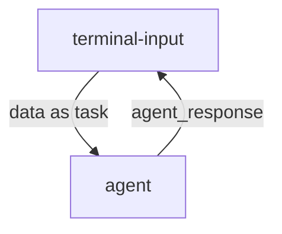

### **技术架构**


### **运行程序**


- 启动数据流

```bash
# 启动数据流
dora up && \
dora build hello_rss_dataflow.yml && \
dora start hello_rss_dataflow.yml
```

- 运行输入节点
```bash
# 在另一个终端运行输入节点
terminal-input
```

### **演示RSS资源**

RSS资源：https://github.com/weekend-project-space/top-rss-list

36kr：https://36kr.com/feed
少数派：https://sspai.com/feed
阮一峰的网络日志：https://www.ruanyifeng.com/blog/atom.xml
美团技术团队: https://tech.meituan.com/feed
虎嗅: https://rss.huxiu.com/