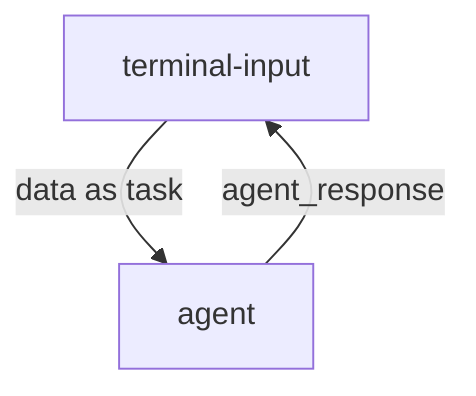

# **Hello World 示例项目**

## **项目概述**
Hello World 是 MoFa 框架中最基础的智能体示例，展示了如何构建、配置和运行一个简单的智能体。它实现了最基本的输入输出模式，是学习 MoFa 框架的最佳起点。

## **团队信息**
- **团队名称**: MoFa团队
- **项目成员**:
  - 睿类文特 (GitCode用户名: zonghuanwu)
  - ChenZi (GitCode用户名: chenzi00103)
- **项目地址**: [GitCode Repo](https://gitcode.com/moxin-org/mofa/overview)

## **核心功能**
- 基础智能体架构
- 输入输出参数处理
- 日志记录与调试
- 分布式节点通信

## **技术架构**


## **安装与运行**

### **环境依赖**
1. Rust (用于运行 Dora-RS 框架)
2. MoFa 框架库


### **运行程序**
```bash
# 启动数据流
dora up && \
dora build hello_world_dataflow.yml && \
dora start hello_world_dataflow.yml

# 在另一个终端运行输入节点
terminal-input
```

## **配置文件说明**

### **hello_world_dataflow.yml**
```yaml
nodes:
  - id: terminal-input
    build: pip install -e ../../node-hub/terminal-input
    path: dynamic
    outputs:
      - data
    inputs:
      agent_response: hello-world-agent/hello_world_result
  - id: hello-world-agent
    build: pip install -e ../../agent-hub/hello-world
    path: hello-world
    outputs:
      - hello_world_result
    inputs:
      query: terminal-input/data
    env:
      IS_DATAFLOW_END: true
      WRITE_LOG: true
```

### **配置项说明**
- **terminal-input**: 终端输入节点
  - `build`: 安装依赖
  - `outputs`: 输出数据标识
  - `inputs`: 接收agent的响应
- **hello-world-agent**: 智能体节点
  - `outputs`: 输出结果标识
  - `inputs`: 接收终端输入
  - `env`: 环境变量配置

## **核心代码说明**

### **智能体主逻辑 (main.py)**
```python
from mofa.agent_build.base.base_agent import MofaAgent, run_agent

@run_agent
def run(agent: MofaAgent):
    """
    智能体核心逻辑
    1. 接收输入参数
    2. 处理业务逻辑
    3. 返回处理结果
    """
    try:
        # 接收输入参数
        user_query = agent.receive_parameter('query')
        
        # 记录日志
        agent.logger.debug(f"Received input: {user_query}")
        
        # 返回处理结果
        agent.send_output(
            agent_output_name='hello_world_result',
            agent_result=user_query
        )
        
    except Exception as e:
        # 错误处理
        agent.logger.error(f"Error processing query: {str(e)}")
        agent.send_error(
            error_code=500,
            error_message="Processing failed"
        )

def main():
    """智能体启动入口"""
    agent = MofaAgent(agent_name='hello-world')
    run(agent=agent)

if __name__ == "__main__":
    main()
```

## **测试案例**
| 输入 | 输出 | 说明 |
|------|------|------|
| hello | hello | 基础输入输出验证 |
| 你好 | 你好 | 中文支持验证 |
| 12345 | 12345 | 数字输入验证 |

## **日志说明**
日志文件位于 `out/` 目录下：
- `log_hello-world-agent.txt`: 智能体运行日志
- `dora-coordinator.txt`: 协调器日志
- `dora-daemon.txt`: 守护进程日志

## **最佳实践**
1. 使用 `agent.logger` 记录关键操作
2. 在 `try-except` 中处理所有业务逻辑
3. 保持输入输出参数类型一致
4. 使用环境变量控制调试模式


