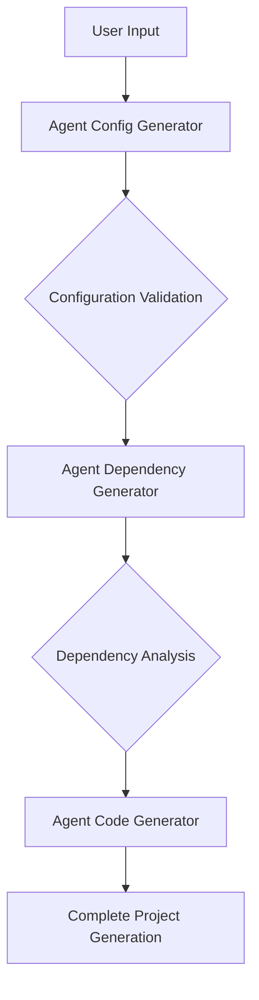

# Agent Generator Suite

The Agent Generator Suite comprises three core agents designed to automate the creation of a complete Python Agent project structure:

1. **Agent Config Generator** – Configuration Generator  
2. **Agent Dependency Generator** – Dependency Generator  
3. **Agent Code Generator** – Code Generator

---

## System Architecture



---

## Feature Overview

### 1. Agent Config Generator
- **Functionality:** Generates the basic configuration for an Agent.
- **Inputs:**
  - User requirement description
  - Technical specification requirements
- **Outputs:**
  - `agent.yml` configuration file
  - `.env.secret` environment variable file
- **Features:**
  - Automatically detects sensitive information
  - Generates secure placeholder configurations
  - Supports separation of development and production environments

### 2. Agent Dependency Generator
- **Functionality:** Analyzes code and generates dependency configurations.
- **Inputs:**
  - Code snippets
  - `agent_name` and `module_name` from the Config Generator's output
- **Outputs:**
  - `pyproject.toml` file
  - `README.md` documentation
- **Features:**
  - Automatically detects code dependencies
  - Generates configurations compliant with Poetry standards
  - Enforces strict naming conventions
  - Automatically includes necessary build configurations

### 3. Agent Code Generator
- **Functionality:** Generates Agent code that conforms to the dora-rs framework.
- **Inputs:**
  - Functional requirements description
  - Configuration and dependency information
- **Outputs:**
  - `main.py` (main program file)
  - `__init__.py` (module file)
- **Features:**
  - Adheres strictly to framework specifications
  - Provides comprehensive error handling mechanisms
  - Supports type conversions
  - Ensures dataflow port consistency

---

## Workflow

1. **Initialization Stage**
   - Users provide functional requirements and technical specifications.
   - The Config Generator creates the basic configuration.

2. **Dependency Analysis Stage**
   - The system analyzes code characteristics.
   - The Dependency Generator produces dependency configurations.

3. **Code Generation Stage**
   - The Code Generator generates code that meets the defined specifications.
   - The complete project structure is automatically created.

---

## Usage Instructions

1. **Agent Configuration:**  
   Configure the agents individually for `agent-hub/agent-config-generator`, `agent-hub/agent-dependency-generator`, and `agent-hub/agent-code-generator`. Under the `agent-name/module_name` directory, create a `.env.secret` file and configure it appropriately. For example:

   ```
   (py310) (base) agent-config-generator % tree
   .
   ├── README.md
   ├── agent_config_generator
   │   ├── __init__.py
   │   ├── __pycache__
   │   │   ├── __init__.cpython-312.pyc
   │   │   └── main.cpython-312.pyc
   │   ├── configs
   │   │   ├── agent.yml
   │   │   └── agent_copy.yml
   │   └── main.py
   ├── pyproject.toml
   └── tests
       └── test_main.py
   ```

   Example `.env.secret` configuration:
   ```
   LLM_API_KEY=sk-
   LLM_BASE_URL=https://api.deepseek.com/v1
   LLM_MODEL_NAME=deepseek-chat
   ```

2. **Installation using Dora Commands:**  
   Execute the following commands:
   - `dora up`
   - `dora build intelligent_agent_creation_dataflow.yml`
   - `dora start intelligent_agent_creation_dataflow.yml`
   - Open a new command prompt, type `terminal-input`, and then enter the code you wish to generate.
