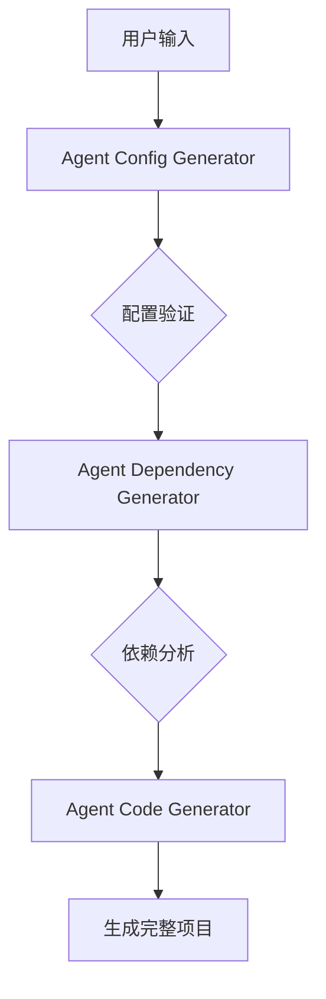

# Agent 生成器套件

本套件包含三个核心Agent，用于自动化生成Python Agent的完整项目结构：

1. **Agent Config Generator** - 配置生成器
2. **Agent Dependency Generator** - 依赖生成器  
3. **Agent Code Generator** - 代码生成器

## 系统架构



## 功能说明

### 1. Agent Config Generator
- **功能**：生成Agent的基础配置
- **输入**：
  - 用户需求描述
  - 技术规范要求
- **输出**：
  - `agent.yml` 配置文件
  - `.env.secret` 环境变量文件
- **特点**：
  - 自动检测敏感信息
  - 生成安全的占位符配置
  - 支持开发和生产环境配置分离

### 2. Agent Dependency Generator
- **功能**：分析代码并生成依赖配置
- **输入**：
  - 代码片段
  - 配置生成器输出的agent_name和module_name
- **输出**：
  - `pyproject.toml` 文件
  - `README.md` 文档
- **特点**：
  - 自动检测代码依赖
  - 生成符合Poetry规范的配置
  - 严格的命名规范验证
  - 自动添加必要的构建配置

### 3. Agent Code Generator
- **功能**：生成符合dora-rs框架的Agent代码
- **输入**：
  - 功能需求描述
  - 配置和依赖信息
- **输出**：
  - `main.py` 主程序文件
  - `__init__.py` 模块文件
- **特点**：
  - 严格的框架规范遵循
  - 完整的错误处理机制
  - 类型转换支持
  - 数据流端口一致性保证

## 工作流程

1. **初始化阶段**
   - 用户提供功能需求和技术规范
   - Config Generator生成基础配置

2. **依赖分析阶段**
   - 系统分析代码特征
   - Dependency Generator生成依赖配置

3. **代码生成阶段**
   - Code Generator生成符合规范的代码
   - 自动创建项目结构


## 使用方法
1. 分别对 agent-hub/agent-config-generator、agent-hub/agent-dependency-generator、agent-hub/agent-code-generator 的Agent进行配置.在`agent-name/module_nmae`下创建`.env.secret`文件，并进行配置
```
(py310) (base) agent-config-generator % tree
.
├── README.md
├── agent_config_generator
│   ├── __init__.py
│   ├── __pycache__
│   │   ├── __init__.cpython-312.pyc
│   │   └── main.cpython-312.pyc
│   ├── configs
│   │   ├── agent.yml
│   │   └── agent_copy.yml
│   └── main.py
├── pyproject.toml
└── tests
    └── test_main.py
```
配置 .env.secret文件
   ~~~ 
   LLM_API_KEY=sk-
   LLM_BASE_URL=https://api.deepseek.com/v1
   LLM_MODEL_NAME=deepseek-chat
   ~~~
2. 使用dora命令进行安装
   - dora up 
   - dora build intelligent_agent_creation_dataflow.yml
   - dora start intelligent_agent_creation_dataflow.yml
   - 新建一个cmd，在里面输入 `terminal-input`，然后输入你要生成的code就可以了

## 注意事项
1. 生成的代码会自动创建一个Agent项目，项目和代码会自动的放到当前目录下
2. 如果你要运行你的Agent，请你确保`Dataflow.yml`和生成的`Agent`不在一个目录下,否则会出现`terminal-input`运行错误的问题

