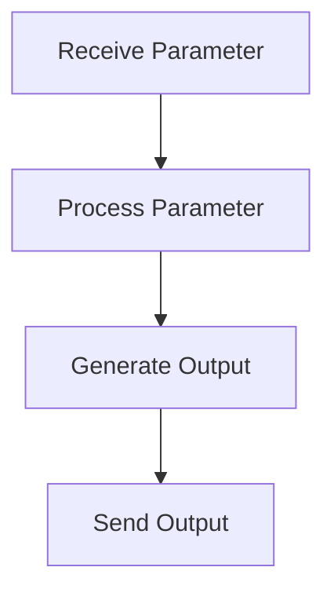

# MofaAgent Documentation

## Overview
This agent is based on the Mofa framework and is designed to handle specific tasks as per the provided code. The agent accepts parameters and processes them to generate outputs.

## Features
- **Parameter Handling**: The agent can receive parameters for processing.
- **Output Generation**: The agent sends outputs based on the processed parameters.

## Workflow


## Class/Method Structure
- **MofaAgent**: The main class that handles the agent's functionality.
  - **receive_parameter**: Method to accept parameters.
  - **send_output**: Method to send the processed output.

## Input/Output Specifications
- **Input**: Parameters received by the agent.
- **Output**: Processed data sent by the agent.

## Usage
1. Initialize the MofaAgent.
2. Use the `receive_parameter` method to accept parameters.
3. The agent processes the parameters and generates output.
4. Use the `send_output` method to send the output.

## Example
```python
agent = MofaAgent()
agent.receive_parameter(param)
output = agent.process()
agent.send_output(output)
```

## Contribution Guidelines
- Ensure all code follows the Mofa framework guidelines.
- Maintain strict naming conventions.
- Provide detailed documentation for any new features.
