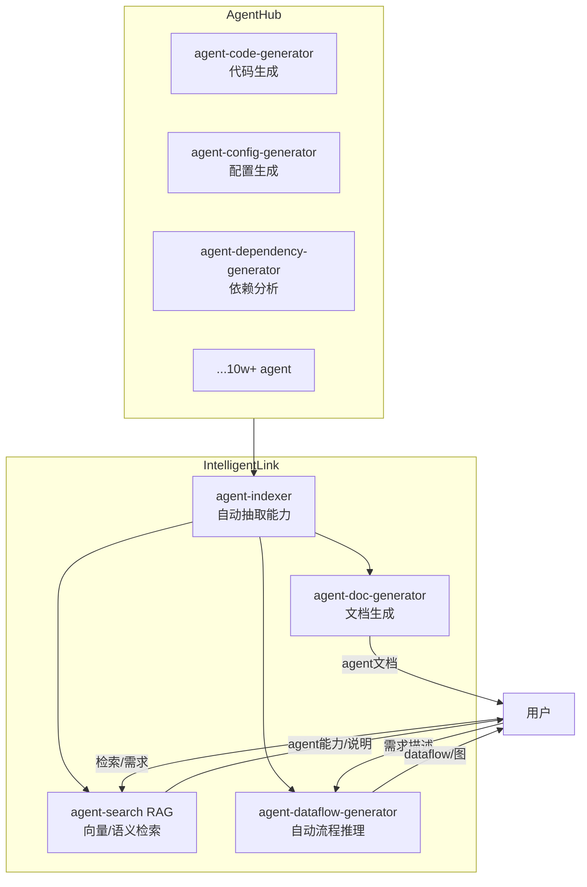
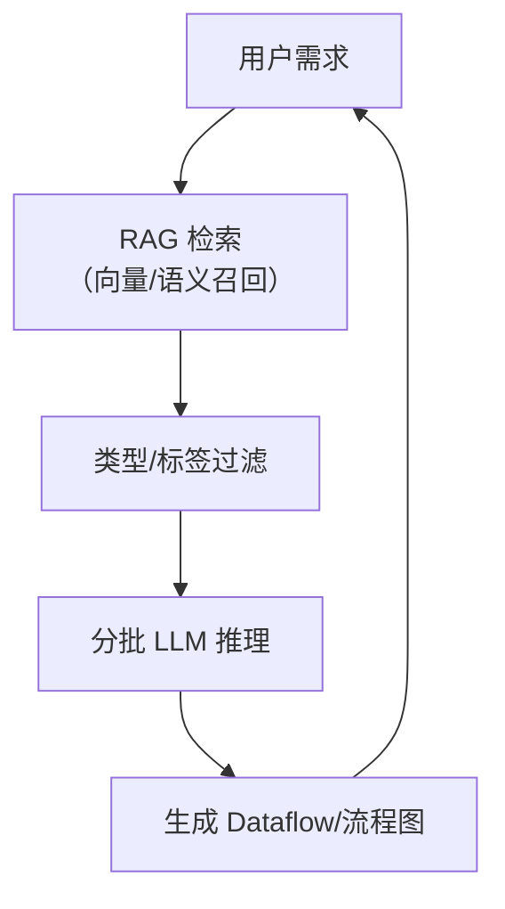
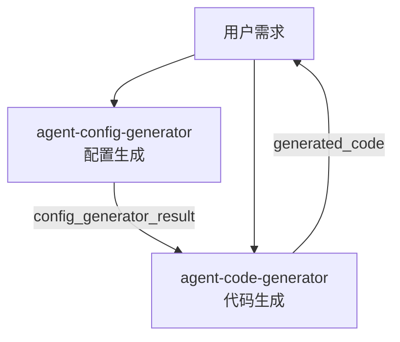

# Intelligent Link 实现文档

---

## 一、目标

1. **Agent 自动索引与说明生成**  
   - 自动扫描 agent-hub 目录下所有 agent（支持十万级别）
   - 结合代码和 README，利用 LLM 自动生成每个 agent 的功能说明、输入输出结构

2. **需求驱动 Dataflow 自动生成**  
   - 用户输入需求后，LLM 根据 agent 能力和需求，自动生成 dataflow（YAML/mermaid/HTML）

3. **Agent 能力自动化索引与检索**  
   - 生成可检索的 agent 能力索引，**采用 RAG（Retrieval-Augmented Generation）** 方式管理和查询多 agent，支持关键词/语义检索


---

## 二、核心 Agent 功能与说明

### 1. agent-indexer
- **功能**：自动扫描 agent-hub，抽取每个 agent 的功能、输入、输出、依赖、README 说明.结构化抽取（数据源头，供机器用）
- **输入**：agent-hub 路径
- **输出**：标准化 agent 能力描述（YAML/JSON）

### 2. agent-doc-generator
- **功能**：根据 agent-indexer 输出，生成详细的 agent 说明文档.文档生成（数据消费，供人用）
- **输入**：agent 能力描述
- **输出**：Markdown/HTML 格式的文档

### 3. agent-dataflow-generator
- **功能**：根据用户需求和 agent 能力，自动推理并生成 dataflow（YAML/mermaid/HTML）
- **输入**：用户需求、agent 能力描述
- **输出**：dataflow 文件（YAML/mermaid/HTML）

### 4. agent-search
- **功能**：支持用户检索 agent 能力、输入输出、用途等
- **输入**：检索关键词
- **输出**：匹配的 agent 及其说明
- **实现**：**基于 RAG**，即先用向量/语义检索召回相关 agent，再用 LLM 生成最终答案

---

## 三、数据结构设计

```yaml
agents:
  - id: agent-config-generator
    name: Agent Config Generator
    description: 解析用户需求，自动生成标准化的配置文件（如数据库、API等）或接口定义，供其他 agent 使用。
    inputs:
      - name: query
        type: string
        description: 用户需求描述
    outputs:
      - name: config_generator_result
        type: string
        description: 生成的配置内容
    dependencies: []
    path: agent-config-generator
    readme: agent-hub/agent-config-generator/README.md
  # ... 其他 agent
```

---

## 四、架构与流程图

### 1. 系统架构图



#### 说明：
- **agent-indexer** 负责从 AgentHub 中抽取所有 agent 的能力信息，供后续模块使用。
- **agent-doc-generator** 生成详细文档，便于查阅和理解。
- **agent-search (RAG)** 作为索引和检索的核心，先用向量/语义召回，再用 LLM 生成答案。
- **agent-dataflow-generator** 根据用户需求和 agent 能力，自动推理并生成 dataflow。

---

### 2. 大规模处理流程图



#### 说明：
- 用户需求首先通过 RAG 检索召回相关 agent（高效处理十万级 agent）。
- 经过类型/标签等结构化过滤，进一步缩小候选集。
- 分批送入 LLM 进行推理，组合出最优 dataflow。
- 最终生成结构化 dataflow（YAML/mermaid/HTML）并返回用户。

---

## 五、输出示例

### 用户输入需求
> “我需要一个能自动生成数据库配置和代码的 agent 流程”

### 系统自动生成 dataflow（YAML/mermaid）

```yaml
nodes:
  - id: agent-config-generator
    outputs: [config_generator_result]
    inputs: [query]
  - id: agent-code-generator
    outputs: [generated_code]
    inputs: [query, agent_config]
edges:
  - from: agent-config-generator
    output: config_generator_result
    to: agent-code-generator
    input: agent_config
```



