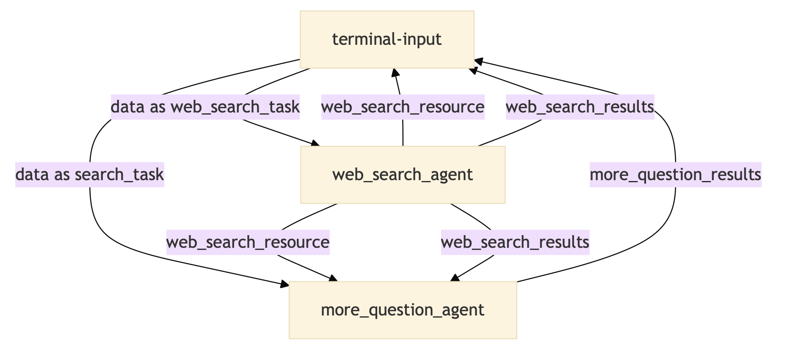

# Simplicity Ai Composite Agent

## 1. Functionality Description

The **Simplicity Ai** agent is designed to search for relevant data from Google based on user task inputs, automatically generate summaries, and propose further questions related to the task. Its design pattern is: **Google Search + Content Summary + Generate Related Questions**.

## 2. Use Cases

This agent is suitable for scenarios that require retrieving relevant information from Google search results, generating summaries, and proposing related questions based on user queries. Common application scenarios include:

- **Content Retrieval and Summarization**: Searching the web for content based on specific questions and summarizing the retrieved information.
- **Generating Follow-up Questions**: Creating additional relevant questions based on user queries to help users explore topics in greater depth.
- **Automated Information Extraction and Question Generation**: Streamlining the processes of information extraction and question generation to enhance research or problem analysis efficiency.

## 3. Configuration Method

The Web Search Task template generates an agent capable of performing web searches, summarizing content, and generating related questions by adjusting the configuration information. Below are the detailed configuration steps and explanations. *(The diagram illustrates the Dora Data Flow of the Simplicity Ai Composite Agent.)*



### Configuration Overview

Configuration files are located in the `configs` directory, and the `.py` files contain the actual agent code. The configuration files specify the behavior of each agent, including search parameters, generation logic, and more.

| **File**                        | **Purpose**                                                                 |
| ------------------------------- | --------------------------------------------------------------------------- |
| `configs/web_search_agent.yml`  | Configures the parameters for the Web Search agent, defining how to retrieve information from Google and extract content and URLs. |
| `configs/more_question_agent.yml` | Configures the logic for generating questions, combining search results to create further questions related to the user's initial query. |
| `web_search_agent.py`           | Executes the Web Search operations, searching for relevant information on Google based on user queries and extracting the content. |
| `more_question_agent.py`        | Generates additional questions related to the initial query, helping users explore deeper levels of the topic. |

### Configuration Steps

1. **Edit the Configuration Files**:
   
   Modify the `.yml` configuration files located in the `configs` directory according to your specific needs. You can customize the model parameters and prompts as required, but it is recommended not to alter the predefined prompts.

2. **Configure `SERPER_API_KEY`**:
   
   When using the agent, you need to configure the `SERPER_API_KEY`. If you do not have one, you can register for a free quota at [Serper.dev](https://serper.dev/).

## 4. Running the Agent

### Running with Dora-rs Command Line

1. **Install MoFA Project Packages**:
   
   Ensure that you have installed all necessary packages for the MoFA project. This typically involves setting up a Python environment and installing the required dependencies.

2. **Execute the Following Command to Start the Agent Process**:
   
   ```bash
   dora up && dora build simplexity_ai_dataflow.yml && dora start simplexity_ai_dataflow.yml --attach
   ```

3. **Initialize Task Input**:
   
   Open another terminal window, run `terminal-input`, and then input the corresponding task to start the Web Search process.

   ```bash
   terminal-input
   Enter your task: Record and retrieve key information about machine learning
   ```

