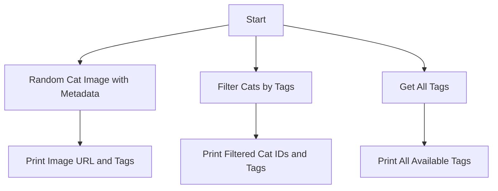

# Cat API Wrapper

This project provides a Python wrapper for interacting with the [CATAAS (Cat as a Service)](https://cataas.com/) API. It includes functionalities to retrieve random cat images with metadata, filter cats by tags, and fetch all available tags.

## Features

1. **Random Cat Image with Metadata**: Retrieves a random cat image along with its metadata (URL and tags) in JSON format.
2. **Filter Cats by Tags**: Returns a list of cat images filtered by specific tags (e.g., "cute" or "orange").
3. **Get All Tags**: Fetches all available tags used to categorize cat images.

## Usage

### Random Cat Image with Metadata
```python
import requests

url = "https://cataas.com/cat?json=true"
response = requests.get(url)

if response.status_code == 200:
    data = response.json()
    print(f"Cat image URL: https://cataas.com{data['url']}")
    print(f"Tags: {', '.join(data['tags'])}")
else:
    print(f"Request to {url} failed with status code: {response.status_code}")
```

### Filter Cats by Tags
```python
import requests

url = "https://cataas.com/api/cats?tags=cute,orange&limit=3"
response = requests.get(url)

if response.status_code == 200:
    cats = response.json()
    for index, cat in enumerate(cats, 1):
        print(f"Cat {index} ID: {cat['_id']}")
        print(f"Tags: {', '.join(cat['tags'])}")
else:
    print(f"Request to {url} failed with status code: {response.status_code}")
```

### Get All Tags
```python
import requests

url = "https://cataas.com/api/tags"
response = requests.get(url)

if response.status_code == 200:
    tags = response.json()
    print(f"Available cat tags: {', '.join(tags)}")
else:
    print(f"Request to {url} failed with status code: {response.status_code}")
```

## Workflow

The following Mermaid diagram illustrates the workflow of the Cat API Wrapper:



## Input/Output Specifications

### Random Cat Image with Metadata
- **Input**: None (implicit `json=true` parameter).
- **Output**: JSON object containing `url` and `tags`.

### Filter Cats by Tags
- **Input**: Query parameters `tags` (comma-separated list) and `limit` (optional).
- **Output**: List of JSON objects, each containing `_id` and `tags`.

### Get All Tags
- **Input**: None.
- **Output**: List of available tags as strings.

## Error Handling
- Each API call includes basic error handling to check the HTTP status code and print an error message if the request fails.