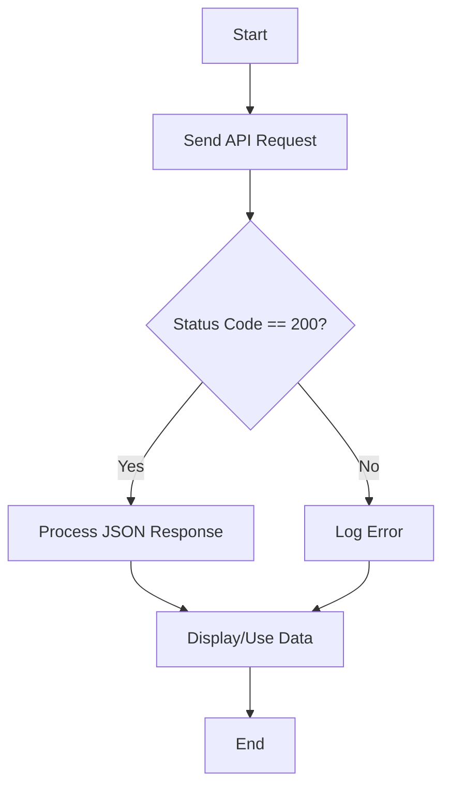

# Frankfurter API Integration

This project demonstrates how to interact with the Frankfurter API to retrieve currency exchange rates, including the latest rates, historical data, and time series.

## Features
- **Latest Exchange Rates**: Retrieve the most recent exchange rates for a base currency (default: EUR).
- **Historical Rates**: Fetch exchange rates for a specific date.
- **Time Series Data**: Get exchange rates over a specified date range.

## Usage

### Latest Exchange Rates
```python
import requests
url = "https://api.frankfurter.dev/v1/latest"
response = requests.get(url)

if response.status_code == 200:
    data = response.json()
    print(f"EUR to USD rate: {data['rates']['USD']}")
else:
    print(f"Request to {url} failed with status code: {response.status_code}")
```

### Historical Rates
```python
import requests
url = "https://api.frankfurter.dev/v1/1999-01-04"
response = requests.get(url)

if response.status_code == 200:
    data = response.json()
    print(f"1999-01-04 EUR to CHF: {data['rates']['CHF']}")
else:
    print(f"Request to {url} failed with status code: {response.status_code}")
```

### Time Series Data
```python
import requests
url = "https://api.frankfurter.dev/v1/2024-01-01..2024-01-05"
response = requests.get(url)

if response.status_code == 200:
    data = response.json()
    for date, rates in data['rates'].items():
        print(f"{date} USD rate: {rates.get('USD')}")
else:
    print(f"Request to {url} failed with status code: {response.status_code}")
```

## Workflow

The following Mermaid diagram illustrates the workflow for retrieving and processing data from the Frankfurter API:



## Input/Output Specifications
- **Input**: API endpoint URLs (e.g., `https://api.frankfurter.dev/v1/latest`).
- **Output**: JSON response containing exchange rates or error messages.

## Error Handling
- The code checks the HTTP status code and logs an error if the request fails.

## Dependencies
- Python `requests` library for making HTTP requests.

## Installation
```bash
pip install requests
```