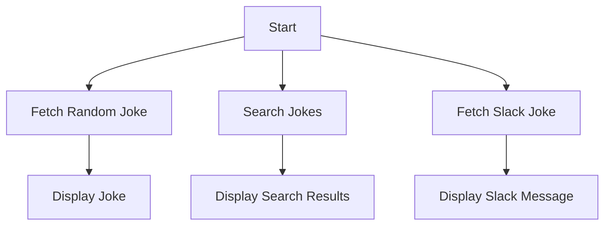

# Dad Jokes API Integration

This repository contains Python scripts to interact with the [icanhazdadjoke.com](https://icanhazdadjoke.com/) API, which provides random dad jokes, joke searches, and Slack-formatted jokes.

## Features

1. **Fetch a Random Dad Joke**: Retrieve a random joke in JSON format.
2. **Search for Dad Jokes**: Search for jokes based on a keyword with pagination support.
3. **Slack-Formatted Joke**: Fetch a joke formatted for Slack integrations.

## Installation

No additional installation is required beyond the Python `requests` library, which is included in the standard library for Python 3.

## Usage

### API 1: Fetch a Random Dad Joke
```python
import requests

url = "https://icanhazdadjoke.com/"
headers = {
    "Accept": "application/json",
    "User-Agent": "Python Script (https://example.com/contact)"
}

response = requests.get(url, headers=headers)

if response.status_code == 200:
    data = response.json()
    print(f"Joke ID: {data['id']}\n{data['joke']}")
else:
    print(f"Request failed with status code: {response.status_code}")
```

**Output**:
- `Joke ID`: Unique identifier for the joke.
- `joke`: The joke content.

### API 2: Search for Dad Jokes
```python
import requests

url = "https://icanhazdadjoke.com/search"
params = {
    "term": "chicken",
    "limit": 3
}
headers = {
    "Accept": "application/json",
    "User-Agent": "Python Script (https://example.com/contact)"
}

response = requests.get(url, headers=headers, params=params)

if response.status_code == 200:
    results = response.json()["results"]
    for joke in results:
        print(f"- {joke['joke']}")
else:
    print(f"Search failed with status code: {response.status_code}")
```

**Parameters**:
- `term`: Keyword to search for.
- `limit`: Number of results per page.

**Output**:
- List of jokes matching the search term.

### API 3: Fetch Slack-Formatted Joke
```python
import requests

url = "https://icanhazdadjoke.com/slack"
headers = {
    "User-Agent": "Python Slack Bot (https://example.com/contact)"
}

response = requests.get(url, headers=headers)

if response.status_code == 200:
    slack_data = response.json()
    print(f"Slack message: {slack_data['attachments'][0]['text']}")
else:
    print(f"Slack request failed with status code: {response.status_code}")
```

**Output**:
- `Slack message`: The joke formatted for Slack.

## Workflow

The following Mermaid diagram illustrates the workflow for fetching and displaying jokes:



## Contributing

Contributions are welcome! Please submit a pull request or open an issue for any improvements or bug fixes.