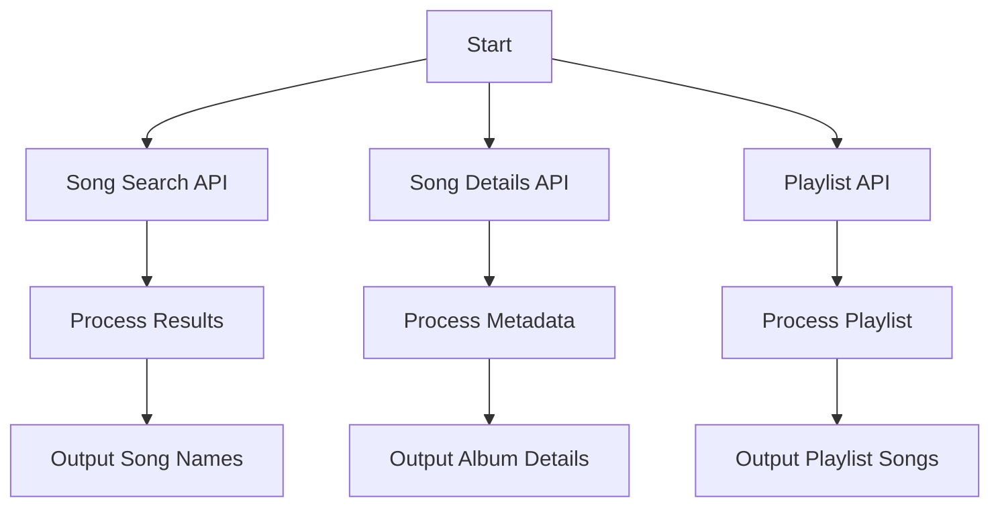

# JioSaavn API Documentation

This document provides an overview of the unofficial JioSaavn API, which allows access to music data such as songs, metadata, and playlists from the JioSaavn streaming service.

## API Endpoints

### 1. Song Search API

**Description**: Search for songs by query.

**Endpoint**: `https://saavn.dev/api/search/songs?query=<search_term>`

**Example Usage**:
```python
import requests

url = "https://saavn.dev/api/search/songs?query=radha"
response = requests.get(url)

if response.status_code == 200:
    data = response.json()
    print(data['results'][0]['name'])  # Example: Print the first song's name
else:
    print(f"Request failed with status code: {response.status_code}")
```

**Output**: Returns a JSON object containing song results matching the query.

---

### 2. Song Details API

**Description**: Retrieve metadata for a specific song using its ID.

**Endpoint**: `https://saavn.dev/api/songs/<song_id>`

**Example Usage**:
```python
import requests

url = "https://saavn.dev/api/songs/9HdN1M"
response = requests.get(url)

if response.status_code == 200:
    data = response.json()
    print(data['album']['name'])  # Example: Print the album name
else:
    print(f"Request failed with status code: {response.status_code}")
```

**Output**: Returns a JSON object containing detailed metadata for the specified song.

---

### 3. Playlist API

**Description**: Fetch contents of a playlist using its ID.

**Endpoint**: `https://saavn.dev/api/playlists/<playlist_id>`

**Example Usage**:
```python
import requests

url = "https://saavn.dev/api/playlists/82914609"
response = requests.get(url)

if response.status_code == 200:
    data = response.json()
    print(data['songs'][0]['artists'])  # Example: Print the artists of the first song
else:
    print(f"Request failed with status code: {response.status_code}")
```

**Output**: Returns a JSON object containing the playlist details and its songs.

---

## Mermaid Workflow



## Notes
- Ensure proper error handling for failed requests.
- The API is unofficial; use it responsibly and respect rate limits.
- Replace `<search_term>`, `<song_id>`, and `<playlist_id>` with actual values in the endpoints.