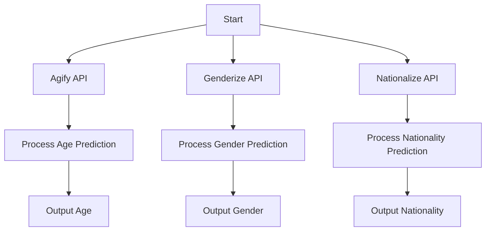

# Name-Based Prediction APIs

This repository contains Python scripts to interact with three name-based prediction APIs: Agify (age prediction), Genderize (gender prediction), and Nationalize (nationality prediction). Each script makes a GET request to the respective API and processes the response to display the prediction.

## APIs Overview

1. **Agify API**: Predicts the age of a person based on their first name.
2. **Genderize API**: Predicts the gender of a person based on their first name.
3. **Nationalize API**: Predicts the nationality of a person based on their first name.

## Code Snippets

### Agify API
```python
import requests
url = "https://api.agify.io"
params = {'name': 'john'}
response = requests.get(url, params=params)

if response.status_code == 200:
    data = response.json()
    print(f"Estimated age for {data['name']}: {data['age']}")
else:
    print(f"Request failed with status code: {response.status_code}")
```

### Genderize API
```python
import requests
url = "https://api.genderize.io"
params = {'name': 'emily'}
response = requests.get(url, params=params)

if response.status_code == 200:
    data = response.json()
    print(f"Gender prediction for {data['name']}: {data['gender']} ({data['probability']*100}%)")
else:
    print(f"Request failed with status code: {response.status_code}")
```

### Nationalize API
```python
import requests
url = "https://api.nationalize.io"
params = {'name': 'mohammed'}
response = requests.get(url, params=params)

if response.status_code == 200:
    data = response.json()
    top_country = data['country'][0]
    print(f"Top nationality prediction: {top_country['country_id']} ({top_country['probability']*100}%)")
else:
    print(f"Request failed with status code: {response.status_code}")
```

## Usage

1. **Install Dependencies**: Ensure you have the `requests` library installed.
   ```bash
   pip install requests
   ```

2. **Run Scripts**: Execute any of the provided scripts to test the respective API.

3. **Customize Input**: Replace the `name` parameter in the `params` dictionary to test different names.

## Output Examples

- **Agify**: `Estimated age for john: 45`
- **Genderize**: `Gender prediction for emily: female (95.0%)`
- **Nationalize**: `Top nationality prediction: SA (30.5%)`

## Workflow Diagram



## Notes

- Ensure you have an active internet connection to use these APIs.
- The APIs may have rate limits; check their respective documentation for details.
- Replace placeholder names (`john`, `emily`, `mohammed`) with the names you want to test.