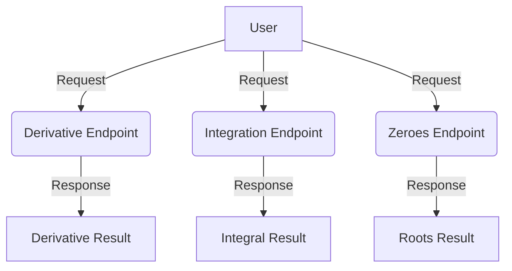

# Newton API Documentation

The Newton API provides mathematical operations such as simplification, derivation, integration, and equation solving through REST endpoints. Below are examples of how to use the API for various operations.

## Endpoints

### 1. Derivative Calculation
This endpoint calculates the derivative of a given mathematical expression.

**Example Usage:**
```python
import requests
url = "https://newton.now.sh/api/v2/derive/x^2"
response = requests.get(url)

if response.status_code == 200:
    data = response.json()
    print(f"The derivative of {data['expression']} is {data['result']}")
else:
    print(f"Request to {url} failed with status code: {response.status_code}")
```

**Output:**
```
The derivative of x^2 is 2x
```

### 2. Integration
This endpoint calculates the integral of a given mathematical expression.

**Example Usage:**
```python
import requests
url = "https://newton.now.sh/api/v2/integrate/x^3"
response = requests.get(url)

if response.status_code == 200:
    data = response.json()
    print(f"The integral of {data['expression']} is {data['result']}")
else:
    print(f"Request to {url} failed with status code: {response.status_code}")
```

**Output:**
```
The integral of x^3 is (1/4)x^4
```

### 3. Finding Equation Roots
This endpoint finds the roots (zeroes) of a given mathematical equation.

**Example Usage:**
```python
import requests
url = "https://newton.now.sh/api/v2/zeroes/x^2-4"
response = requests.get(url)

if response.status_code == 200:
    data = response.json()
    print(f"Zeros of {data['expression']} are at {data['result']}")
else:
    print(f"Request to {url} failed with status code: {response.status_code}")
```

**Output:**
```
Zeros of x^2-4 are at [-2, 2]
```

## Workflow

The following Mermaid diagram illustrates the workflow of interacting with the Newton API:



## Input/Output Specifications
- **Input:** Mathematical expressions as strings (e.g., `x^2`, `x^3`, `x^2-4`).
- **Output:** JSON response containing the original expression and the computed result.

## Error Handling
- If the request fails, the API returns the HTTP status code for debugging.

## Notes
- Ensure the mathematical expressions are properly formatted.
- The API supports basic calculus and algebra operations.