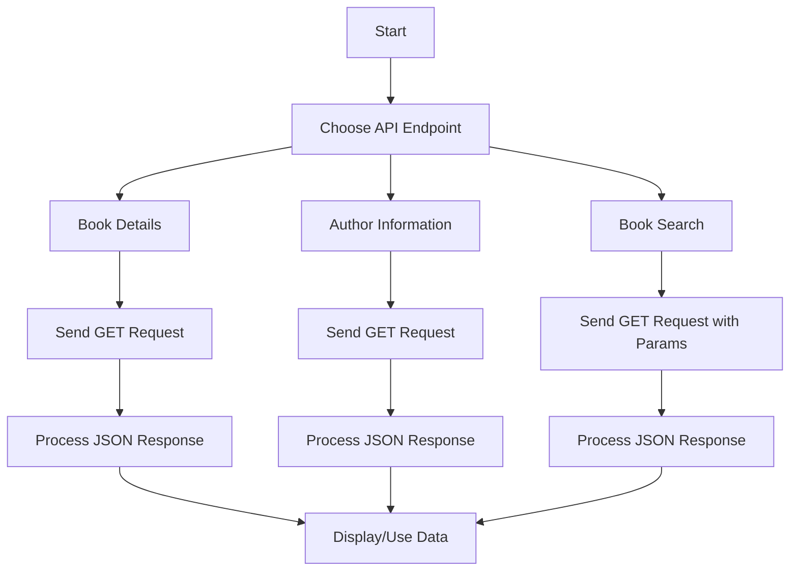

# Open Library API Integration

This project provides Python code snippets for interacting with the Open Library API to retrieve book details, author information, and search results.

## Features

1. **Book Details Retrieval**: Fetch detailed information about a specific book using its Open Library identifier.
2. **Author Information Retrieval**: Retrieve biographical information and works by an author using their Open Library identifier.
3. **Book Search**: Search for books by query parameters (e.g., title, author).

## Code Snippets

### 1. Book Details Retrieval
```python
import requests
url = "https://openlibrary.org/works/OL15626917W.json"
response = requests.get(url)

if response.status_code == 200:
    # Process the JSON response here to extract book details
    # Example: data = response.json()
    #          print(data.get('title'))
else:
    print(f"Request to {url} failed with status code: {response.status_code}")
```

### 2. Author Information Retrieval
```python
import requests
url = "https://openlibrary.org/authors/OL33421A.json"
response = requests.get(url)

if response.status_code == 200:
    # Process the JSON response here to extract author information
    # Example: data = response.json()
    #          print(data.get('personal_name'))
else:
    print(f"Request to {url} failed with status code: {response.status_code}")
```

### 3. Book Search
```python
import requests
url = "https://openlibrary.org/search.json"
params = {'q': 'harry potter', 'limit': 10}
response = requests.get(url, params=params)

if response.status_code == 200:
    # Process the JSON response here to access search results
    # Example: data = response.json()
    #          print(data['docs'][0]['title_suggest'])
else:
    print(f"Request to {url} failed with status code: {response.status_code}")
```

## Workflow



## Input/Output Specifications

- **Input**: Open Library identifier (e.g., `OL15626917W` for books, `OL33421A` for authors) or search query parameters.
- **Output**: JSON response containing book details, author information, or search results.

## Notes
- Ensure the `requests` library is installed (`pip install requests`).
- Handle exceptions and edge cases (e.g., invalid identifiers, network issues) in production code.