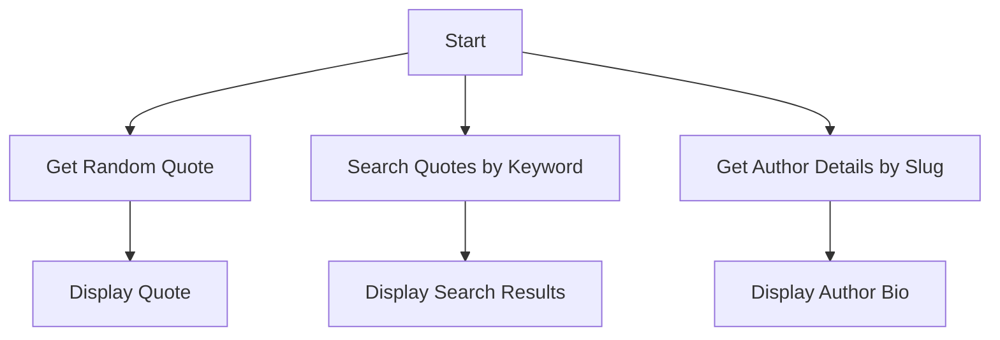

# Quotable API Integration

This project provides Python scripts to interact with the Quotable API, which offers access to a collection of quotes, authors, and tags. The API supports filtering quotes by author, tags, length, and search operations.

## Features

1. **Get Random Quote**: Fetches a random quote from the Quotable API.
2. **Search Quotes by Keyword**: Searches quotes based on a keyword (e.g., "technology").
3. **Get Author Details by Slug**: Retrieves detailed information about an author using their slug (e.g., "albert-einstein").

## Usage

### 1. Get Random Quote
```python
import requests
url = "https://api.quotable.io/quotes/random"
response = requests.get(url)

if response.status_code == 200:
    data = response.json()
    print(f'"{data[0]["content"]}" - {data[0]["author"]}')
else:
    print(f"Request to {url} failed with status code: {response.status_code}")
```

### 2. Search Quotes by Keyword
```python
import requests
url = "https://api.quotable.io/search/quotes"
params = {"query": "technology", "fields": "content"}
response = requests.get(url, params=params)

if response.status_code == 200:
    data = response.json()
    print([quote['content'] for quote in data['results']])
else:
    print(f"Request to {url} failed with status code: {response.status_code}")
```

### 3. Get Author Details by Slug
```python
import requests
url = "https://api.quotable.io/authors/slug/albert-einstein"
response = requests.get(url)

if response.status_code == 200:
    data = response.json()
    print(data['bio'])
else:
    print(f"Request to {url} failed with status code: {response.status_code}")
```

## Workflow



## Input/Output Specifications

- **Input**: API endpoints and optional parameters (e.g., `query`, `fields`).
- **Output**: JSON response containing quotes, search results, or author details.

## Error Handling

- Each script checks the HTTP status code and prints an error message if the request fails.

## Dependencies

- Python `requests` library.

## Installation

```bash
pip install requests
```