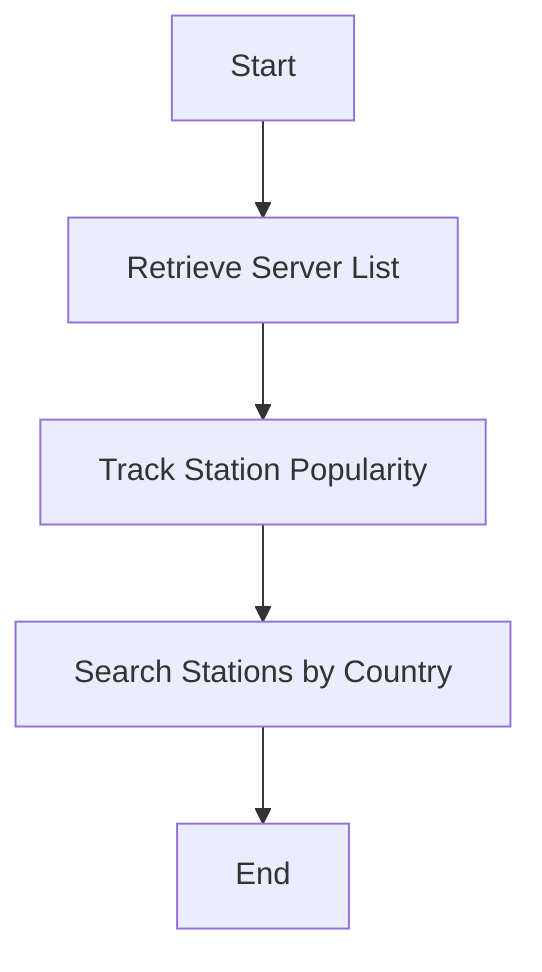

# Radio-Browser API Integration

This project provides Python scripts to interact with the Radio-Browser API, which offers functionalities for retrieving server lists, tracking station popularity, and searching radio stations by country code.

## Features

1. **Server List Retrieval**: Fetch a randomized list of available Radio-Browser servers for load balancing and failover.
2. **Station Popularity Tracking**: Record user clicks on stations to improve the recommendation system.
3. **Station Search by Country**: Search for radio stations by ISO 3166-1 alpha-2 country code.

## API Endpoints

### 1. Server List Retrieval
- **Endpoint**: `https://api.radio-browser.info/json/servers`
- **Method**: `GET`
- **Response**: JSON list of servers with details like `name`, `ip`, etc.

```python
import requests
url = "https://api.radio-browser.info/json/servers"
response = requests.get(url)

if response.status_code == 200:
    servers = response.json()
    print(f"Available servers: {[s['name'] for s in servers]}")
else:
    print(f"Request to {url} failed with status code: {response.status_code}")
```

### 2. Station Popularity Tracking
- **Endpoint**: `https://de1.api.radio-browser.info/json/url/{station_uuid}`
- **Method**: `GET`
- **Parameters**: `station_uuid` (string) - Unique identifier of the station.
- **Response**: JSON metadata of the clicked station.

```python
import requests
station_uuid = "00000000-0000-0000-0000-000000000000"  # Example station UUID
url = f"https://de1.api.radio-browser.info/json/url/{station_uuid}"
response = requests.get(url)

if response.status_code == 200:
    print(f"Clicked: {response.json()['name']}")
else:
    print(f"Request to {url} failed with status code: {response.status_code}")
```

### 3. Station Search by Country
- **Endpoint**: `https://fr1.api.radio-browser.info/json/stations/search?countrycode={country_code}`
- **Method**: `GET`
- **Parameters**: `country_code` (string) - ISO 3166-1 alpha-2 country code.
- **Response**: JSON list of stations with metadata like `name`, `url`, etc.

```python
import requests
country_code = "US"  # ISO 3166-1 alpha-2 code
url = f"https://fr1.api.radio-browser.info/json/stations/search?countrycode={country_code}"
response = requests.get(url)

if response.status_code == 200:
    stations = response.json()
    print(f"Found {len(stations)} stations in {country_code}")
else:
    print(f"Request to {url} failed with status code: {response.status_code}")
```

## Workflow



## Input/Output Specifications

### Inputs
- **Server List**: No input parameters required.
- **Station Popularity**: `station_uuid` (string).
- **Station Search**: `country_code` (string).

### Outputs
- **Server List**: JSON array of server objects.
- **Station Popularity**: JSON metadata of the clicked station.
- **Station Search**: JSON array of station objects.

## Error Handling
- All endpoints return HTTP status codes. Handle non-200 responses appropriately.

## Dependencies
- Python `requests` library for HTTP requests.

## Usage
1. Install the `requests` library:
   ```bash
   pip install requests
   ```
2. Run the scripts as shown in the examples above.

## Contribution
Feel free to fork and submit pull requests for additional features or improvements.