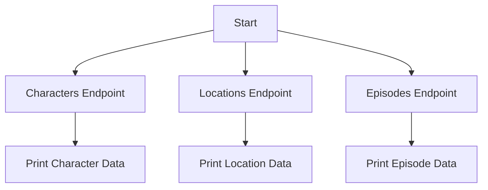

# Rick and Morty API Integration

This project provides Python scripts to interact with the Rick and Morty API, fetching data from three endpoints: Characters, Locations, and Episodes.

## Features
- **Characters Endpoint**: Retrieve character details such as name, species, and status.
- **Locations Endpoint**: Fetch location information including type and dimension.
- **Episodes Endpoint**: Access episode metadata like name and air date.

## Installation
No additional installation is required beyond the standard Python `requests` library.
```bash
pip install requests
```

## Usage
Each script is standalone and can be executed independently to fetch data from the respective endpoint.

### Characters Endpoint
```python
import requests

url = "https://rickandmortyapi.com/api/character"
response = requests.get(url)

if response.status_code == 200:
    data = response.json()
    # Access the first character's name and status:
    print(data['results'][0]['name'], data['results'][0]['status'])
else:
    print(f"Request failed: {response.status_code}")
```

### Locations Endpoint
```python
import requests

url = "https://rickandmortyapi.com/api/location"
response = requests.get(url)

if response.status_code == 200:
    data = response.json()
    # Access the first location's type and dimension:
    print(data['results'][0]['type'], data['results'][0]['dimension'])
else:
    print(f"Request failed: {response.status_code}")
```

### Episodes Endpoint
```python
import requests

url = "https://rickandmortyapi.com/api/episode"
response = requests.get(url)

if response.status_code == 200:
    data = response.json()
    # Access the first episode's name and air date:
    print(data['results'][0]['name'], data['results'][0]['air_date'])
else:
    print(f"Request failed: {response.status_code}")
```

## Output Examples
- **Characters**: `Rick Sanchez Alive`
- **Locations**: `Planet Dimension C-137`
- **Episodes**: `Pilot December 2, 2013`

## Mermaid Workflow Diagram


## Notes
- Ensure an active internet connection for API requests.
- The scripts handle basic error responses by printing the status code.
