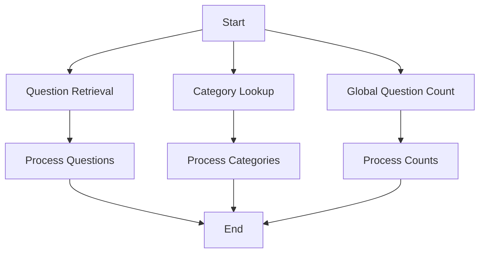

# Open Trivia Database API Integration

This project provides a Python interface to interact with the Open Trivia Database API, allowing users to retrieve trivia questions, list available categories, and fetch global question statistics.

## Features

1. **Question Retrieval**: Fetch a specified number of trivia questions with customizable parameters like category, difficulty, and type.
2. **Category Lookup**: List all available trivia categories and their IDs for use in question requests.
3. **Global Question Count**: Retrieve statistics about the total number of questions in the database.

## Usage

### Question Retrieval
```python
import requests
url = "https://opentdb.com/api.php?amount=10&category=9&difficulty=easy&type=multiple"
response = requests.get(url)

if response.status_code == 200:
    data = response.json()
    print(data['results'][0]['question'])  # Example: Print the first question
else:
    print(f"Request to {url} failed with status code: {response.status_code}")
```

### Category Lookup
```python
import requests
url = "https://opentdb.com/api_category.php"
response = requests.get(url)

if response.status_code == 200:
    categories = response.json()['trivia_categories']
    print([cat['name'] for cat in categories])  # Example: Print all category names
else:
    print(f"Request to {url} failed with status code: {response.status_code}")
```

### Global Question Count
```python
import requests
url = "https://opentdb.com/api_count_global.php"
response = requests.get(url)

if response.status_code == 200:
    counts = response.json()['overall']
    print(f"Total questions: {counts['total_num_of_questions']}")  # Example: Print total questions
else:
    print(f"Request to {url} failed with status code: {response.status_code}")
```

## Workflow



## Input/Output Specifications

### Question Retrieval
- **Input**: `amount`, `category`, `difficulty`, `type`
- **Output**: JSON containing trivia questions and answers.

### Category Lookup
- **Input**: None
- **Output**: JSON containing trivia categories and their IDs.

### Global Question Count
- **Input**: None
- **Output**: JSON containing question count statistics.

## Notes
- Ensure the `requests` library is installed (`pip install requests`).
- Handle API rate limits and errors gracefully in production code.