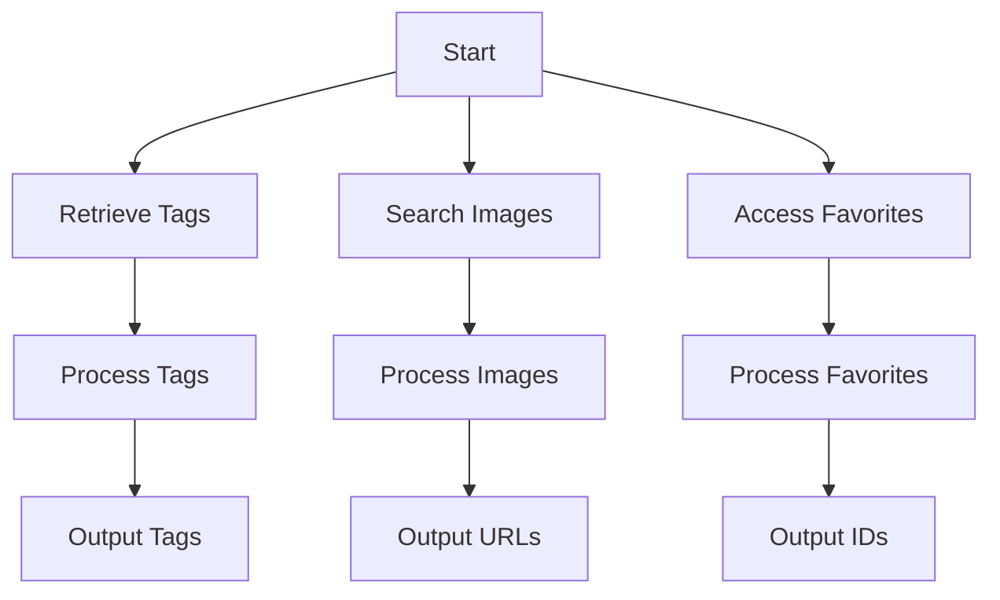

# Waifu Image API Documentation

This documentation provides details on how to interact with the Waifu Image API to retrieve tags, search images, and access user favorites.

## API Endpoints

### 1. Retrieve Available Tags
**Endpoint:** `https://api.waifu.im/tags`
**Method:** `GET`
**Description:** Fetches a list of available tags for categorizing waifu images.

**Example Request:**
```python
import requests
url = "https://api.waifu.im/tags"
response = requests.get(url)

if response.status_code == 200:
    tags = response.json()['tags']
    print([tag['name'] for tag in tags])
else:
    print(f"Request to {url} failed with status code: {response.status_code}")
```

**Output:**
A list of tag names.

---

### 2. Search Waifu Images
**Endpoint:** `https://api.waifu.im/search`
**Method:** `GET`
**Description:** Searches for waifu images based on specified tags and parameters.

**Parameters:**
- `included_tags`: Comma-separated list of tags to include.
- `limit`: Maximum number of images to return.

**Example Request:**
```python
import requests
url = "https://api.waifu.im/search"
params = {'included_tags': 'maid', 'limit': 5}
response = requests.get(url, params=params)

if response.status_code == 200:
    data = response.json()
    print([img['url'] for img in data['images']])
else:
    print(f"Request to {url} failed with status code: {response.status_code}")
```

**Output:**
A list of image URLs matching the specified tags.

---

### 3. Access User Favorites
**Endpoint:** `https://api.waifu.im/favorites`
**Method:** `GET`
**Description:** Retrieves a user's favorite waifu images (requires authentication).

**Headers:**
- `Authorization`: Bearer token for authentication.

**Example Request:**
```python
import requests
url = "https://api.waifu.im/favorites"
headers = {'Authorization': 'Bearer YOUR_API_KEY'}
response = requests.get(url, headers=headers)

if response.status_code == 200:
    favorites = response.json()['images']
    print([f['image_id'] for f in favorites])
else:
    print(f"Request to {url} failed with status code: {response.status_code}")
```

**Output:**
A list of image IDs from the user's favorites.

## Workflow



## Notes
- Ensure valid API key for accessing favorites.
- Handle errors gracefully (e.g., invalid tags, rate limits).