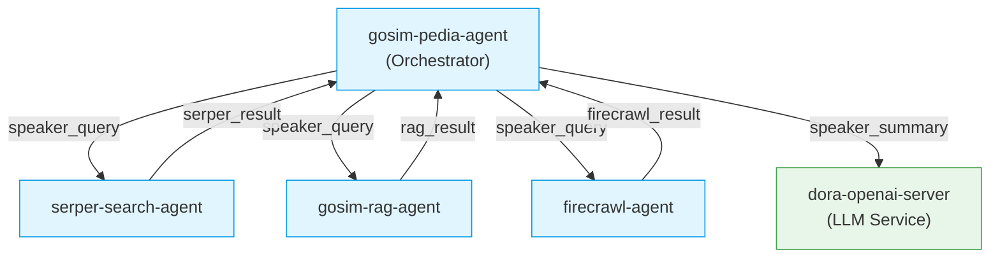

# GOSIM Pedia - AI-Powered Speaker Encyclopedia System


GOSIM Pedia is a distributed agent system that automatically generates comprehensive speaker profiles by aggregating and synthesizing information from multiple sources.

## Key Features

- **Multi-source Intelligence Fusion**:
  - Web search (Serper API)
  - Deep research (Firecrawl)
  - Vector database retrieval (ChromaDB)
- **Structured Output Generation**:
  - Chronological career timeline
  - Academic publications
  - Media appearances
  - Awards and achievements
- **Modular Agent Architecture**:
  - Independent components with clear interfaces
  - Parallel query execution
  - Schema-driven data validation

## System Architecture

### Core Components

| Component              | Description                                                                 |
|------------------------|-----------------------------------------------------------------------------|
| `gosim-pedia-agent`    | Orchestrates the workflow and generates final profiles                      |
| `serper-search-agent`  | Performs web searches using Google Serper API                               |
| `gosim-rag-agent`      | Retrieves relevant information from vector database                         |
| `firecrawl-agent`      | Conducts deep web research with configurable depth and analysis             |
| `dora-openai-server`   | Provides LLM capabilities for information synthesis                         |

### Data Flow



## Getting Started

### Prerequisites

- Python 3.10+
- Dora framework
- API keys for:
  - Serper (web search)
  - Firecrawl (deep research)
  - OpenAI (LLM services)


1. Configure environment variables:
   ```bash
   cp .env.example .env.secret
   # Edit with your API keys
   ```

### Running the System

1. Start the Dora runtime:
   ```bash
   dora up
   ```

2. Build and start the dataflow:
   ```bash
   dora build gosim-pedia-dataflow.yml
   dora start gosim-pedia-dataflow.yml
   ```


