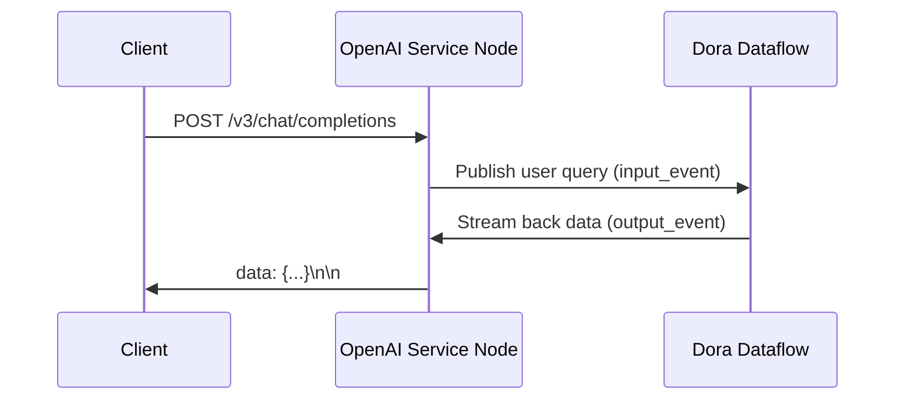

# Dora OpenAI Streaming Service Node

A FastAPI-based OpenAI-compatible streaming API service that is deeply integrated with the Dora dataflow framework.

## Features 🚀
- Fully implements the OpenAI ChatCompletions streaming API specification
- Supports handling multiple concurrent requests
- Automatically forwards requests to Dora dataflow nodes
- Streams back agent-generated content in real time
- Built-in request rate limiting (30 RPM/Token)
- Supports CORS for cross-origin access

## Architecture Design


## Quick Start

### 1. Install Dependencies
```bash
poetry install
```

## API Documentation

### Request Endpoint
```http
POST /v3/chat/completions
```

### Request Example
```python
from openai import OpenAI

client = OpenAI(
    base_url="http://localhost:8000/v3",
    api_key="sk-jsha-1234567890"
)

response = client.chat.completions.create(
    model="gpt-4o-mini",
    messages=[{"role": "user", "content": "Explain quantum computing"}],
    stream=True
)

for chunk in response:
    print(chunk.choices[0].delta.content or "")
```

### Response Structure
```json
{
  "id": "chatcmpl-8Q2FQ3q7v9Y6wX",
  "object": "chat.completion.chunk",
  "created": 1712271048,
  "model": "gpt-4o-mini",
  "choices": [
    {
      "index": 0,
      "delta": {
        "content": "Quantum computing is based on..."
      },
      "finish_reason": null
    }
  ]
}
```