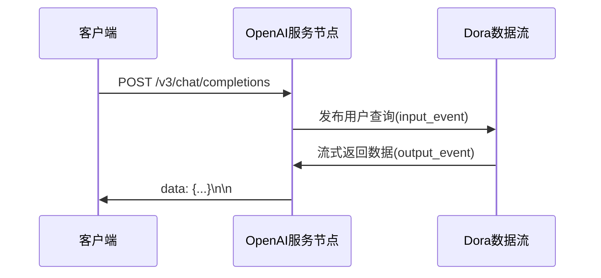

# Dora OpenAI 流式服务节点

基于FastAPI实现的OpenAI兼容流式API服务，深度集成Dora数据流框架

## 功能特性 🚀
- 完整实现OpenAI ChatCompletions流式API规范
- 支持多路并发请求处理
- 自动将请求转发至Dora数据流节点
- 实时流式返回代理生成内容
- 内置请求频率限制(30 RPM/Token)
- 支持CORS跨域访问

## 架构设计


## 快速启动

### 1. 安装依赖
```bash
poetry install
```


## API 文档

### 请求端点
```http
POST /v3/chat/completions
```

### 请求示例
```python
from openai import OpenAI

client = OpenAI(
    base_url="http://localhost:8000/v3",
    api_key="sk-jsha-1234567890"
)

response = client.chat.completions.create(
    model="gpt-4o-mini",
    messages=[{"role": "user", "content": "解释量子计算"}],
    stream=True
)

for chunk in response:
    print(chunk.choices[0].delta.content or "")
```

### 响应结构
```json
{
  "id": "chatcmpl-8Q2FQ3q7v9Y6wX",
  "object": "chat.completion.chunk",
  "created": 1712271048,
  "model": "gpt-4o-mini",
  "choices": [
    {
      "index": 0,
      "delta": {
        "content": "量子计算是基于..."
      },
      "finish_reason": null
    }
  ]
}
```
